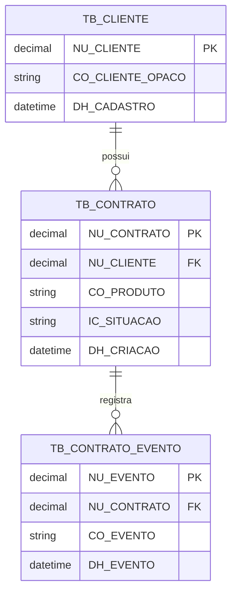
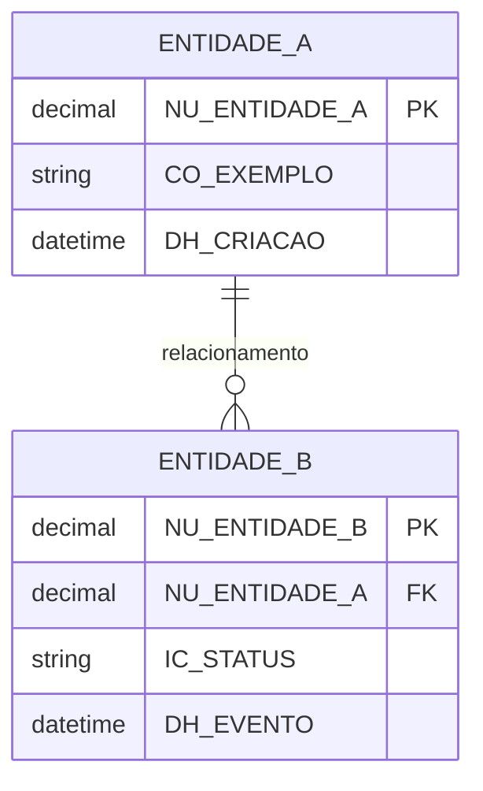

# Kit de Instruções para GitHub Copilot no VS Code — Banco de Dados, SQL, Mermaid e Entity Framework

**Contexto:** uso do GitHub Copilot profissional no VS Code, em ambiente corporativo da CAIXA.  
**Objetivo:** melhorar a qualidade das respostas do Copilot para demandas de banco de dados, modelagem, SQL, DB2, Oracle, Microsoft SQL Server, Mermaid ER e Entity Framework, usando instruções versionadas no repositório.

> **Importante:** os exemplos de nomenclatura e regex deste documento são modelos ilustrativos. Substitua pelas regras oficiais da CAIXA antes de usar em projeto real. O Copilot deve ser instruído a nunca inventar padrão CAIXA ausente no repositório.

---

## 1. Visão geral da solução

A recomendação é criar uma pequena camada de governança de IA dentro do repositório, combinando:

| Necessidade                                                  | Recurso recomendado           | Local sugerido                                    |
| ------------------------------------------------------------ | ----------------------------- | ------------------------------------------------- |
| Regras gerais do projeto                                     | Custom instructions           | `.github/copilot-instructions.md`                 |
| Regras específicas por tema/linguagem                        | File-based instructions       | `.github/instructions/*.instructions.md`          |
| Capacidade especializada e reutilizável de banco             | Agent Skill                   | `.github/skills/caixa-database-standard/SKILL.md` |
| Persona especializada                                        | Custom Agent                  | `.github/agents/arquiteto-banco-caixa.agent.md`   |
| Tarefas recorrentes invocáveis por comando                   | Prompt files / slash commands | `.github/prompts/*.prompt.md`                     |
| Acesso governado a catálogo, metadados e dicionário de dados | MCP Server                    | `.vscode/mcp.json`                                |

Resumo prático:

```text
Custom instructions = regras gerais
.instructions.md    = regras específicas por arquivo ou tarefa
Agent Skill         = capacidade especializada, com referências e scripts
Custom Agent        = persona persistente, como "arquiteto de banco"
Prompt files        = comandos reutilizáveis de chat
MCP                 = acesso controlado a ferramentas e metadados externos
```

---

## 2. Estrutura recomendada de pastas

Crie a seguinte estrutura na raiz do repositório:

```text
.github/
  copilot-instructions.md

  instructions/
    database-naming.instructions.md
    sql-ddl.instructions.md
    entity-framework.instructions.md
    mermaid-er.instructions.md
    seguranca-lgpd-banco.instructions.md

  agents/
    arquiteto-banco-caixa.agent.md
    revisor-banco-caixa.agent.md

  prompts/
    modelar-tabela-caixa.prompt.md
    revisar-ddl-caixa.prompt.md
    gerar-mermaid-er.prompt.md
    revisar-entity-framework.prompt.md

  skills/
    caixa-database-standard/
      SKILL.md
      references/
        naming-conventions.md
        regex-validations.md
        sql-dialects.md
        mermaid-er-patterns.md
        entity-framework-patterns.md
        checklist-revisao-banco.md
      scripts/
        validate-db-names.py
        validate-ddl.py

.vscode/
  mcp.json
```

---

## 3. Ordem de implantação recomendada

Implante em camadas, validando uma antes de avançar para a próxima.

### Fase 1 — Base mínima

1. Criar `.github/copilot-instructions.md`.
2. Criar `.github/instructions/database-naming.instructions.md`.
3. Criar `.github/instructions/sql-ddl.instructions.md`.
4. Testar com 3 a 5 demandas reais anonimizadas.

### Fase 2 — Especialização

1. Criar a skill `.github/skills/caixa-database-standard/`.
2. Criar arquivos de referência.
3. Criar scripts simples de validação.
4. Testar geração de DDL, Mermaid e revisão de nomenclatura.

### Fase 3 — Agentes e comandos

1. Criar o agente `arquiteto-banco-caixa`.
2. Criar o agente `revisor-banco-caixa`.
3. Criar prompts reutilizáveis.
4. Padronizar uso pela equipe.

### Fase 4 — Integração com metadados reais

1. Avaliar MCP somente leitura.
2. Integrar com catálogo, dicionário de dados ou metadados controlados.
3. Evitar consulta direta a dados produtivos.
4. Submeter à governança, segurança e LGPD.

---

## 4. Arquivo global do repositório

### Caminho

```text
.github/copilot-instructions.md
```

### Conteúdo sugerido

```md
# Instruções gerais para o Copilot neste repositório

Este projeto segue padrões internos da CAIXA para arquitetura, segurança, banco de dados, nomenclatura de objetos, documentação técnica e proteção de dados.

## Regras gerais

- Responda em português brasileiro, exceto quando o usuário pedir outro idioma.
- Seja objetivo, mas explique decisões técnicas relevantes.
- Não invente padrões CAIXA ausentes no repositório.
- Quando uma regra CAIXA não estiver documentada, sinalize explicitamente a lacuna.
- Não use dados reais sensíveis em exemplos.
- Não inclua credenciais, tokens, chaves, strings de conexão reais, CPFs, contas, telefones ou e-mails reais.
- Prefira exemplos sintéticos, anonimizados e claramente fictícios.
- Quando houver dúvida relevante de negócio, faça pergunta objetiva antes de gerar artefato definitivo.
- Quando a demanda envolver banco de dados, consulte os arquivos em:
  - `.github/instructions/`
  - `.github/skills/caixa-database-standard/references/`

## Banco de dados

Sempre que gerar, revisar ou alterar artefatos de banco de dados:

- Identifique o SGBD: DB2, Oracle ou Microsoft SQL Server.
- Se o SGBD não for informado, pergunte antes de gerar DDL definitivo.
- Gere SQL compatível com o SGBD informado.
- Preserve nomes físicos existentes quando o banco legado exigir compatibilidade.
- Não proponha alteração estrutural em banco legado sem indicar risco, impacto e plano de migração.
- Para modelagem nova, entregue:
  - entidades;
  - relacionamentos;
  - DDL;
  - diagrama Mermaid ER;
  - checklist de aderência ao padrão;
  - observações de segurança, LGPD e rastreabilidade.

## Entity Framework

Ao gerar código C# com Entity Framework:

- Prefira Fluent API para mapeamentos explícitos.
- Preserve nomes físicos de tabelas e colunas.
- Use `ToTable`, `HasColumnName`, `HasKey`, `HasIndex`, `HasPrecision`, `HasMaxLength` e constraints explícitas.
- Separe entidade, configuração EF, DTOs e consultas específicas.
- Não assuma que convenções C# coincidem com nomes físicos do banco legado.

## Mermaid

Ao gerar diagramas Mermaid:

- Use `erDiagram` para modelo entidade-relacionamento.
- Mantenha nomes consistentes com o DDL.
- Represente cardinalidades relevantes.
- Inclua chaves primárias e estrangeiras quando possível.
- Evite diagramas excessivamente grandes; se necessário, divida por domínio.

## Segurança e LGPD

- Evite dados pessoais em exemplos.
- Indique campos potencialmente sensíveis.
- Sugira mascaramento, minimização e controle de acesso quando aplicável.
- Para trilhas de auditoria, prefira campos técnicos explícitos de criação, alteração, origem e correlação, conforme padrão do projeto.
```

---

## 5. Instruções específicas de nomenclatura

### Caminho

```text
.github/instructions/database-naming.instructions.md
```

### Conteúdo sugerido

```md
---
name: "Padrão de nomenclatura de banco CAIXA"
description: "Regras para nomear tabelas, colunas, índices, constraints, sequences, views, procedures e demais objetos de banco conforme padrões internos da CAIXA."
applyTo: "**/*.{sql,ddl,dml,md,cs,json,yml,yaml}"
---

# Padrão de nomenclatura de banco CAIXA

Ao gerar ou revisar objetos de banco:

1. Validar nomes contra as regras documentadas em:
   - `../skills/caixa-database-standard/references/naming-conventions.md`
   - `../skills/caixa-database-standard/references/regex-validations.md`

2. Não criar nome de objeto fora do padrão documentado.

3. Quando uma regra estiver ausente:
   - sinalizar explicitamente a lacuna;
   - propor alternativa marcada como "sugestão";
   - não afirmar que a sugestão é padrão CAIXA.

4. Para cada objeto criado ou revisado, entregar:
   - nome proposto;
   - tipo do objeto;
   - justificativa;
   - regra aplicada;
   - regex aplicada, quando existir;
   - resultado da validação;
   - exemplo válido e inválido, quando aplicável.

5. Para tabelas e colunas:
   - evitar abreviações não documentadas;
   - manter consistência semântica;
   - diferenciar identificadores técnicos de atributos negociais;
   - preservar nomes existentes quando o banco legado exigir compatibilidade.

6. Para constraints e índices:
   - indicar tabela de origem;
   - indicar colunas envolvidas;
   - explicar finalidade;
   - evitar nomes genéricos como `IDX1`, `CONSTRAINT1`, `FK_TESTE`.

## Formato de revisão esperado

Ao revisar nomes, responder com tabela:

| Objeto | Tipo | Nome atual/proposto | Regra aplicada | Status | Correção sugerida |
| ------ | ---- | ------------------- | -------------- | ------ | ----------------- |

Status possíveis:

- `ADERENTE`
- `NÃO ADERENTE`
- `REGRA AUSENTE`
- `NECESSITA CONFIRMAÇÃO`
```

---

## 6. Instruções específicas para SQL e DDL

### Caminho

```text
.github/instructions/sql-ddl.instructions.md
```

### Conteúdo sugerido

```md
---
name: "SQL e DDL corporativo"
description: "Regras para gerar e revisar SQL, DDL, constraints, índices, migrações e scripts de banco para DB2, Oracle e Microsoft SQL Server."
applyTo: "**/*.{sql,ddl,dml}"
---

# SQL e DDL corporativo

Ao trabalhar com SQL ou DDL:

1. Identifique o SGBD:
   - DB2;
   - Oracle;
   - Microsoft SQL Server.

2. Não misture dialetos SQL sem avisar.

3. Para cada DDL gerado, incluir:
   - criação de tabela;
   - chave primária;
   - chaves estrangeiras;
   - constraints relevantes;
   - índices necessários;
   - comentários técnicos, se o padrão do projeto permitir;
   - observações de compatibilidade com o SGBD.

4. Não usar comandos destrutivos sem alerta:
   - `DROP`;
   - `TRUNCATE`;
   - `DELETE` sem filtro;
   - alteração de tipo de coluna;
   - redução de tamanho de coluna;
   - alteração de nulidade;
   - alteração de chave primária.

5. Para alterações em banco legado:
   - indicar impacto;
   - sugerir script reversível quando possível;
   - indicar plano de rollback;
   - indicar risco de lock;
   - indicar risco de volume;
   - indicar necessidade de janela de manutenção.

6. Para índices:
   - justificar pelo padrão de consulta esperado;
   - evitar criar índice desnecessário;
   - considerar cardinalidade;
   - considerar colunas de filtro, junção e ordenação;
   - indicar impacto em escrita.

7. Para campos sensíveis:
   - sinalizar potencial sensibilidade;
   - sugerir mascaramento ou tokenização quando aplicável;
   - evitar exemplos com dados reais.

## Saída esperada

Sempre que gerar DDL, responder com:

1. Premissas
2. DDL
3. Índices e justificativas
4. Mermaid ER
5. Checklist de aderência
6. Riscos e pontos de atenção
7. Perguntas pendentes
```

---

## 7. Instruções específicas para Entity Framework

### Caminho

```text
.github/instructions/entity-framework.instructions.md
```

### Conteúdo sugerido

```md
---
name: "Entity Framework com banco legado CAIXA"
description: "Regras para mapear bancos legados DB2, Oracle ou SQL Server usando Entity Framework sem violar nomenclatura, compatibilidade e governança de dados."
applyTo: "**/*.cs"
---

# Entity Framework para banco legado

Ao gerar código Entity Framework:

- Prefira Fluent API para mapeamentos explícitos.
- Não presuma que nomes de tabelas e colunas seguem convenções C#.
- Preserve nomes físicos do banco com:
  - `ToTable`;
  - `HasColumnName`;
  - `HasKey`;
  - `HasIndex`;
  - `HasConstraintName`;
  - `HasMaxLength`;
  - `HasPrecision`;
  - `IsRequired`.

## Organização recomendada

Separar:

- entidade de domínio;
- configuração EF;
- DTOs;
- queries específicas;
- migrations, quando permitidas;
- repositórios ou services, conforme arquitetura do projeto.

## Banco legado

Quando o banco for legado:

- Não renomear objetos físicos sem autorização.
- Não criar migration destrutiva sem alerta.
- Não inferir relacionamento sem evidência.
- Se houver tabela sem chave primária clara, sinalizar problema.
- Se houver coluna com significado ambíguo, pedir confirmação.

## Checklist EF obrigatório

Ao revisar ou gerar mapeamento EF, verificar:

| Item              | Verificação                             |
| ----------------- | --------------------------------------- |
| Tabela            | `ToTable` explícito                     |
| Colunas           | `HasColumnName` explícito               |
| Chave primária    | `HasKey` definido                       |
| Tamanho de string | `HasMaxLength` definido                 |
| Decimal           | `HasPrecision` definido                 |
| Nulidade          | `IsRequired` ou nullable coerente       |
| Índices           | `HasIndex` quando necessário            |
| Relacionamentos   | `HasOne`, `WithMany`, `HasForeignKey`   |
| Constraint        | Nome físico preservado quando aplicável |
| Tipos específicos | Compatíveis com DB2/Oracle/SQL Server   |
```

---

## 8. Instruções específicas para Mermaid ER

### Caminho

```text
.github/instructions/mermaid-er.instructions.md
```

### Conteúdo sugerido

````md
---
name: "Diagramas Mermaid ER"
description: "Regras para gerar diagramas entidade-relacionamento em Mermaid a partir de modelos, DDL, classes C# ou descrições de negócio."
applyTo: "**/*.{md,mmd,mermaid,sql,cs}"
---

# Diagramas Mermaid ER

Ao gerar diagramas Mermaid ER:

- Use `erDiagram`.
- Mantenha nomes coerentes com o modelo físico ou lógico solicitado.
- Não invente relacionamentos sem evidência.
- Represente cardinalidades sempre que possível.
- Marque PK e FK nos atributos quando útil.
- Evite diagrama grande demais; se passar de 10 entidades, proponha divisão por domínio.
- Quando houver conflito entre nome lógico e físico, mostre ambos se necessário.

## Exemplo de padrão esperado


````

## Resposta esperada

Ao gerar Mermaid, entregar também:

1. Explicação das entidades
2. Explicação dos relacionamentos
3. Observações de cardinalidade
4. Lacunas ou premissas

````

---

## 9. Instruções de segurança e LGPD para banco

### Caminho

```text
.github/instructions/seguranca-lgpd-banco.instructions.md
````

### Conteúdo sugerido

````md
---
name: "Segurança e LGPD em banco de dados"
description: "Regras para avaliar dados sensíveis, minimização, mascaramento, auditoria, retenção e controle de acesso em artefatos de banco de dados."
applyTo: "**/*.{sql,ddl,dml,md,cs,json,yml,yaml}"
---

# Segurança e LGPD em banco de dados

Ao gerar ou revisar artefatos de banco:

## Dados sensíveis

Sinalizar campos que possam conter:

- CPF;
- nome;
- telefone;
- e-mail;
- conta;
- agência;
- endereço;
- chave Pix;
- identificadores persistentes;
- dados de comportamento;
- dados transacionais;
- dados financeiros;
- dados de localização;
- qualquer dado pessoal ou sensível.

## Regras

- Não usar dados reais em exemplos.
- Preferir identificadores opacos.
- Minimizar armazenamento de dados pessoais.
- Sugerir mascaramento ou tokenização quando aplicável.
- Separar dados técnicos de dados pessoais.
- Indicar necessidade de controle de acesso por perfil.
- Indicar necessidade de trilha de auditoria.
- Indicar política de retenção quando aplicável.

## Auditoria

Quando aplicável, sugerir campos técnicos como:

- data/hora de criação;
- usuário/sistema de criação;
- data/hora de alteração;
- usuário/sistema de alteração;
- origem do evento;
- identificador de correlação;
- status de processamento.

## Resposta esperada

Incluir uma seção:

```md
## Segurança, LGPD e auditoria

| Item               | Avaliação | Recomendação |
| ------------------ | --------- | ------------ |
| Dados pessoais     | ...       | ...          |
| Minimização        | ...       | ...          |
| Mascaramento       | ...       | ...          |
| Controle de acesso | ...       | ...          |
| Auditoria          | ...       | ...          |
| Retenção           | ...       | ...          |
```
````

````

---

## 10. Agent Skill de banco

### Caminho

```text
.github/skills/caixa-database-standard/SKILL.md
````

### Conteúdo sugerido

```md
---
name: caixa-database-standard
description: Especialista em modelagem, revisão e geração de artefatos de banco de dados conforme padrões internos da CAIXA. Use esta skill quando a tarefa envolver SQL, DB2, Oracle, Microsoft SQL Server, nomenclatura de objetos, DDL, modelagem relacional, Mermaid ER, Entity Framework, validação de padrões, scripts de migração ou revisão de banco legado.
argument-hint: "[descrição da demanda de banco, SGBD, contexto do sistema]"
---

# CAIXA Database Standard

Esta skill orienta o Copilot a atuar como especialista em banco de dados corporativo, com foco em padrões CAIXA, modelagem relacional, SQL, Mermaid ER e Entity Framework.

## Procedimento obrigatório

Ao receber uma demanda de banco:

1. Identificar o tipo da tarefa:
   - modelagem conceitual;
   - modelo lógico;
   - modelo físico;
   - DDL;
   - revisão de SQL;
   - Mermaid ER;
   - Entity Framework;
   - migração;
   - análise de banco legado.

2. Identificar o SGBD:
   - DB2;
   - Oracle;
   - Microsoft SQL Server;
   - desconhecido.

3. Se o SGBD for desconhecido, perguntar antes de gerar SQL definitivo.

4. Consultar as referências:
   - [naming-conventions.md](./references/naming-conventions.md)
   - [regex-validations.md](./references/regex-validations.md)
   - [sql-dialects.md](./references/sql-dialects.md)
   - [mermaid-er-patterns.md](./references/mermaid-er-patterns.md)
   - [entity-framework-patterns.md](./references/entity-framework-patterns.md)
   - [checklist-revisao-banco.md](./references/checklist-revisao-banco.md)

5. Produzir saída estruturada:
   - entendimento da demanda;
   - premissas;
   - modelo proposto;
   - DDL ou ajuste SQL;
   - diagrama Mermaid, quando aplicável;
   - impacto em Entity Framework, quando aplicável;
   - checklist de aderência;
   - pendências e perguntas objetivas.

6. Nunca afirmar que uma regra é padrão CAIXA se ela não estiver documentada nas referências.

7. Quando houver conflito entre simplicidade técnica e padrão CAIXA, priorizar o padrão CAIXA e explicar o impacto.

## Validação automatizada

Quando houver scripts disponíveis em `scripts/`, use-os para validar nomes, DDL e padrões antes de concluir a resposta.

Scripts previstos:

- [validate-db-names.py](./scripts/validate-db-names.py)
- [validate-ddl.py](./scripts/validate-ddl.py)

## Formato mínimo de resposta

Sempre que possível, responder com:

1. Resumo da solução
2. Premissas
3. Artefatos gerados
4. SQL/DDL
5. Mermaid ER
6. Mapeamento Entity Framework, se aplicável
7. Checklist de conformidade
8. Riscos e pontos de atenção
9. Pendências e perguntas
```

---

## 11. Referência: convenções de nomenclatura

### Caminho

```text
.github/skills/caixa-database-standard/references/naming-conventions.md
```

### Conteúdo sugerido

```md
# Convenções de nomenclatura de banco

> Substituir este conteúdo pelas regras oficiais da CAIXA.
> Os exemplos abaixo são ilustrativos e não devem ser tratados como padrão oficial.

## Princípios

- O nome físico deve ser previsível.
- O nome deve refletir o significado negocial ou técnico do objeto.
- Abreviações só devem ser usadas quando documentadas.
- Nomes genéricos devem ser evitados.
- Objetos legados devem preservar compatibilidade física quando necessário.
- Toda exceção deve ser justificada.

## Tipos de objetos

| Objeto            | Prefixo ilustrativo | Exemplo ilustrativo    | Observação                   |
| ----------------- | ------------------: | ---------------------- | ---------------------------- |
| Tabela            |               `TB_` | `TB_CLIENTE_CONTA`     | Tabela de dados persistentes |
| View              |               `VW_` | `VW_CLIENTE_ATIVO`     | Visão lógica                 |
| Índice            |               `IX_` | `IX_CLIENTE_CPF`       | Índice não único             |
| Índice único      |               `UX_` | `UX_CLIENTE_CODIGO`    | Índice único                 |
| Chave primária    |               `PK_` | `PK_CLIENTE`           | Constraint de chave primária |
| Chave estrangeira |               `FK_` | `FK_CONTRATO_CLIENTE`  | Constraint de relacionamento |
| Check constraint  |               `CK_` | `CK_CONTRATO_STATUS`   | Validação de domínio         |
| Sequence          |               `SQ_` | `SQ_CLIENTE`           | Geração de identificador     |
| Procedure         |               `PR_` | `PR_PROCESSA_CONTRATO` | Rotina procedural            |
| Function          |               `FN_` | `FN_CALCULA_DV`        | Função                       |
| Trigger           |               `TR_` | `TR_AUDITA_CONTRATO`   | Trigger                      |

## Colunas

| Tipo de coluna       | Prefixo ilustrativo | Exemplo ilustrativo | Observação             |
| -------------------- | ------------------: | ------------------- | ---------------------- |
| Número/identificador |               `NU_` | `NU_CLIENTE`        | Identificador numérico |
| Código               |               `CO_` | `CO_PRODUTO`        | Código de domínio      |
| Descrição            |               `DE_` | `DE_PRODUTO`        | Descrição textual      |
| Nome                 |               `NO_` | `NO_CLIENTE`        | Nome                   |
| Indicador            |               `IC_` | `IC_ATIVO`          | Indicador/status       |
| Data                 |               `DT_` | `DT_CONTRATACAO`    | Data sem hora          |
| Data/hora            |               `DH_` | `DH_CRIACAO`        | Timestamp              |
| Valor                |               `VR_` | `VR_CONTRATO`       | Valor monetário        |
| Quantidade           |               `QT_` | `QT_PARCELA`        | Quantidade             |

## Regras de decisão

1. Se o objeto representa entidade persistente, avaliar uso de tabela.
2. Se o objeto representa projeção derivada, avaliar uso de view.
3. Se a coluna representa identificador, usar padrão de identificador.
4. Se a coluna representa domínio enumerado, usar padrão de código ou indicador.
5. Se a coluna possui dado pessoal, registrar classificação e controles.
6. Se o nome proposto não couber no limite do SGBD, priorizar abreviações documentadas.
```

---

## 12. Referência: regex de validação

### Caminho

```text
.github/skills/caixa-database-standard/references/regex-validations.md
```

### Conteúdo sugerido

```md
# Validações por expressão regular

> Substituir pelas regras oficiais da CAIXA.
> Regex abaixo são apenas exemplos de estrutura.

## Tabelas

| Tipo   | Regex ilustrativa      | Exemplo válido     | Exemplo inválido |
| ------ | ---------------------- | ------------------ | ---------------- |
| Tabela | `^TB_[A-Z0-9_]{3,27}$` | `TB_CLIENTE_CONTA` | `ClienteConta`   |
| View   | `^VW_[A-Z0-9_]{3,27}$` | `VW_CLIENTE_ATIVO` | `VIEW_CLIENTE`   |

## Colunas

| Tipo       | Regex ilustrativa      | Exemplo válido   | Exemplo inválido |
| ---------- | ---------------------- | ---------------- | ---------------- |
| Número     | `^NU_[A-Z0-9_]{3,27}$` | `NU_CLIENTE`     | `ID_CLIENTE`     |
| Código     | `^CO_[A-Z0-9_]{3,27}$` | `CO_PRODUTO`     | `COD_PRODUTO`    |
| Descrição  | `^DE_[A-Z0-9_]{3,27}$` | `DE_PRODUTO`     | `DESC_PRODUTO`   |
| Indicador  | `^IC_[A-Z0-9_]{3,27}$` | `IC_ATIVO`       | `FLAG_ATIVO`     |
| Data       | `^DT_[A-Z0-9_]{3,27}$` | `DT_CONTRATACAO` | `DATA_CONTRATO`  |
| Data/hora  | `^DH_[A-Z0-9_]{3,27}$` | `DH_CRIACAO`     | `DATA_HORA`      |
| Valor      | `^VR_[A-Z0-9_]{3,27}$` | `VR_CONTRATO`    | `VALOR_TOTAL`    |
| Quantidade | `^QT_[A-Z0-9_]{3,27}$` | `QT_PARCELA`     | `QTD_PARCELA`    |

## Constraints e índices

| Tipo         | Regex ilustrativa      | Exemplo válido        | Exemplo inválido |
| ------------ | ---------------------- | --------------------- | ---------------- |
| Primary key  | `^PK_[A-Z0-9_]{3,27}$` | `PK_CLIENTE`          | `CLIENTE_PK`     |
| Foreign key  | `^FK_[A-Z0-9_]{3,27}$` | `FK_CONTRATO_CLIENTE` | `FK1`            |
| Check        | `^CK_[A-Z0-9_]{3,27}$` | `CK_CONTRATO_STATUS`  | `CHECK_STATUS`   |
| Índice       | `^IX_[A-Z0-9_]{3,27}$` | `IX_CLIENTE_CPF`      | `IDX_CLIENTE`    |
| Índice único | `^UX_[A-Z0-9_]{3,27}$` | `UX_CLIENTE_CODIGO`   | `UNQ_CLIENTE`    |

## Orientação ao Copilot

Ao aplicar estas regex:

1. Validar cada objeto individualmente.
2. Informar a regex usada.
3. Informar se o nome está aderente.
4. Quando não aderente, sugerir correção.
5. Quando a regex for apenas ilustrativa, não afirmar que é padrão oficial.
```

---

## 13. Referência: diferenças entre DB2, Oracle e SQL Server

### Caminho

```text
.github/skills/caixa-database-standard/references/sql-dialects.md
```

### Conteúdo sugerido

```md
# Dialetos SQL: DB2, Oracle e Microsoft SQL Server

Este arquivo orienta o Copilot a não misturar sintaxe de SGBDs.

## Regra principal

Antes de gerar DDL definitivo, identificar o SGBD:

- DB2;
- Oracle;
- Microsoft SQL Server.

Se o SGBD não for informado, perguntar.

## Pontos de atenção

| Tema                    | DB2                                | Oracle                                  | SQL Server                  |
| ----------------------- | ---------------------------------- | --------------------------------------- | --------------------------- |
| Auto incremento         | `GENERATED ... AS IDENTITY`        | `GENERATED ... AS IDENTITY` ou sequence | `IDENTITY`                  |
| Timestamp               | `TIMESTAMP`                        | `TIMESTAMP` / `DATE`                    | `datetime2`                 |
| Texto variável          | `VARCHAR`                          | `VARCHAR2`                              | `varchar` / `nvarchar`      |
| Número decimal          | `DECIMAL(p,s)`                     | `NUMBER(p,s)`                           | `decimal(p,s)`              |
| Booleano                | geralmente `CHAR(1)` ou `SMALLINT` | geralmente `CHAR(1)` ou `NUMBER(1)`     | `bit` ou padrão corporativo |
| Comentário              | `COMMENT ON`                       | `COMMENT ON`                            | Extended properties         |
| Limite de identificador | Verificar versão/padrão            | Verificar versão/padrão                 | Verificar versão/padrão     |

## Saída esperada

Ao gerar DDL:

1. Declarar explicitamente o SGBD alvo.
2. Não usar sintaxe de outro SGBD.
3. Se houver recurso incompatível, explicar alternativa.
4. Para scripts portáveis, separar por SGBD.
```

---

## 14. Referência: padrões Mermaid ER

### Caminho

```text
.github/skills/caixa-database-standard/references/mermaid-er-patterns.md
```

### Conteúdo sugerido

````md
# Padrões para Mermaid ER

## Template básico


````

## Cardinalidades Mermaid

| Notação | Significado aproximado |
| ------- | ---------------------- | ----- | ---------------------- | -------------------- | ---------------------- |
| `       |                        | --    |                        | `                    | um para um obrigatório |
| `       |                        | --o   | `                      | um para zero ou um   |
| `       |                        | --    | {`                     | um para um ou muitos |
| `       |                        | --o{` | um para zero ou muitos |

## Regras

- Usar nomes consistentes com DDL.
- Não misturar nomes físicos e lógicos sem explicar.
- Evitar relacionamento sem base textual, DDL ou regra informada.
- Incluir PK e FK quando possível.
- Para modelos grandes, dividir por domínio.

````

---

## 15. Referência: padrões Entity Framework

### Caminho

```text
.github/skills/caixa-database-standard/references/entity-framework-patterns.md
````

### Conteúdo sugerido

````md
# Padrões Entity Framework para banco corporativo

## Exemplo de entidade

```csharp
public sealed class ClienteContrato
{
    public long NumeroContrato { get; private set; }
    public long NumeroCliente { get; private set; }
    public string CodigoProduto { get; private set; } = string.Empty;
    public string IndicadorSituacao { get; private set; } = string.Empty;
    public DateTime DataHoraCriacao { get; private set; }

    private ClienteContrato()
    {
    }
}
```
````

## Exemplo de configuração Fluent API

```csharp
using Microsoft.EntityFrameworkCore;
using Microsoft.EntityFrameworkCore.Metadata.Builders;

public sealed class ClienteContratoConfiguration : IEntityTypeConfiguration<ClienteContrato>
{
    public void Configure(EntityTypeBuilder<ClienteContrato> builder)
    {
        builder.ToTable("TB_CLIENTE_CONTRATO");

        builder.HasKey(x => x.NumeroContrato)
            .HasName("PK_CLIENTE_CONTRATO");

        builder.Property(x => x.NumeroContrato)
            .HasColumnName("NU_CONTRATO")
            .IsRequired();

        builder.Property(x => x.NumeroCliente)
            .HasColumnName("NU_CLIENTE")
            .IsRequired();

        builder.Property(x => x.CodigoProduto)
            .HasColumnName("CO_PRODUTO")
            .HasMaxLength(20)
            .IsRequired();

        builder.Property(x => x.IndicadorSituacao)
            .HasColumnName("IC_SITUACAO")
            .HasMaxLength(1)
            .IsRequired();

        builder.Property(x => x.DataHoraCriacao)
            .HasColumnName("DH_CRIACAO")
            .IsRequired();

        builder.HasIndex(x => x.NumeroCliente)
            .HasDatabaseName("IX_CLIENTE_CONTRATO_CLIENTE");
    }
}
```

## Regras

- Usar Fluent API para banco legado.
- Preservar nome físico de tabela, coluna, índice e constraint.
- Evitar depender de convenções automáticas.
- Explicitar tamanho, precisão e nulidade.
- Não gerar migration destrutiva sem revisão.
- Separar entidade de configuração.

````

---

## 16. Referência: checklist de revisão de banco

### Caminho

```text
.github/skills/caixa-database-standard/references/checklist-revisao-banco.md
````

### Conteúdo sugerido

```md
# Checklist de revisão de banco

Use este checklist ao revisar ou gerar artefatos de banco.

## 1. Identificação

| Item                          | Status | Observação |
| ----------------------------- | ------ | ---------- |
| SGBD informado                |        |            |
| Ambiente informado            |        |            |
| Banco legado ou novo          |        |            |
| Impacto transacional avaliado |        |            |

## 2. Nomenclatura

| Item                      | Status | Observação |
| ------------------------- | ------ | ---------- |
| Tabelas seguem padrão     |        |            |
| Colunas seguem padrão     |        |            |
| PK segue padrão           |        |            |
| FK segue padrão           |        |            |
| Índices seguem padrão     |        |            |
| Constraints seguem padrão |        |            |
| Abreviações documentadas  |        |            |

## 3. Modelagem

| Item                                | Status | Observação |
| ----------------------------------- | ------ | ---------- |
| Entidades fazem sentido             |        |            |
| Relacionamentos estão claros        |        |            |
| Cardinalidade está definida         |        |            |
| Chaves primárias estão definidas    |        |            |
| Chaves estrangeiras estão definidas |        |            |
| Nulidade está coerente              |        |            |
| Domínios estão representados        |        |            |

## 4. Performance

| Item                             | Status | Observação |
| -------------------------------- | ------ | ---------- |
| Índices necessários avaliados    |        |            |
| Índices excessivos evitados      |        |            |
| Consultas prováveis consideradas |        |            |
| Volume esperado considerado      |        |            |
| Risco de lock avaliado           |        |            |

## 5. Segurança e LGPD

| Item                         | Status | Observação |
| ---------------------------- | ------ | ---------- |
| Dados pessoais identificados |        |            |
| Minimização avaliada         |        |            |
| Mascaramento avaliado        |        |            |
| Controle de acesso avaliado  |        |            |
| Auditoria avaliada           |        |            |
| Retenção avaliada            |        |            |

## 6. Entity Framework

| Item                         | Status | Observação |
| ---------------------------- | ------ | ---------- |
| `ToTable` explícito          |        |            |
| `HasColumnName` explícito    |        |            |
| `HasKey` definido            |        |            |
| Tamanho e precisão definidos |        |            |
| Relacionamentos mapeados     |        |            |
| Nomes físicos preservados    |        |            |

## Status permitidos

- `OK`
- `NÃO OK`
- `NÃO APLICÁVEL`
- `NECESSITA CONFIRMAÇÃO`
- `REGRA AUSENTE`
```

---

## 17. Script de validação de nomes

### Caminho

```text
.github/skills/caixa-database-standard/scripts/validate-db-names.py
```

### Conteúdo sugerido

```python
#!/usr/bin/env python3
"""
Validador simples de nomenclatura de objetos de banco.

Uso:
    python validate-db-names.py nomes.json

Exemplo de entrada:
{
  "objects": [
    {"type": "table", "name": "TB_CLIENTE"},
    {"type": "column_number", "name": "NU_CLIENTE"},
    {"type": "index", "name": "IX_CLIENTE_CPF"}
  ]
}

Observação:
    As regex são ilustrativas. Substitua pelas regras oficiais.
"""

import json
import re
import sys
from pathlib import Path

RULES = {
    "table": r"^TB_[A-Z0-9_]{3,27}$",
    "view": r"^VW_[A-Z0-9_]{3,27}$",
    "column_number": r"^NU_[A-Z0-9_]{3,27}$",
    "column_code": r"^CO_[A-Z0-9_]{3,27}$",
    "column_description": r"^DE_[A-Z0-9_]{3,27}$",
    "column_indicator": r"^IC_[A-Z0-9_]{3,27}$",
    "column_date": r"^DT_[A-Z0-9_]{3,27}$",
    "column_datetime": r"^DH_[A-Z0-9_]{3,27}$",
    "column_value": r"^VR_[A-Z0-9_]{3,27}$",
    "column_quantity": r"^QT_[A-Z0-9_]{3,27}$",
    "primary_key": r"^PK_[A-Z0-9_]{3,27}$",
    "foreign_key": r"^FK_[A-Z0-9_]{3,27}$",
    "check": r"^CK_[A-Z0-9_]{3,27}$",
    "index": r"^IX_[A-Z0-9_]{3,27}$",
    "unique_index": r"^UX_[A-Z0-9_]{3,27}$",
}


def validate_object(obj):
    object_type = obj.get("type")
    name = obj.get("name", "")

    if object_type not in RULES:
        return {
            "type": object_type,
            "name": name,
            "status": "REGRA_AUSENTE",
            "regex": None,
            "message": f"Tipo sem regra cadastrada: {object_type}",
        }

    pattern = RULES[object_type]
    is_valid = re.fullmatch(pattern, name or "") is not None

    return {
        "type": object_type,
        "name": name,
        "status": "ADERENTE" if is_valid else "NAO_ADERENTE",
        "regex": pattern,
        "message": "Nome aderente" if is_valid else "Nome fora do padrão",
    }


def main():
    if len(sys.argv) != 2:
        print("Uso: python validate-db-names.py nomes.json", file=sys.stderr)
        return 2

    input_path = Path(sys.argv[1])

    if not input_path.exists():
        print(f"Arquivo não encontrado: {input_path}", file=sys.stderr)
        return 2

    data = json.loads(input_path.read_text(encoding="utf-8"))
    objects = data.get("objects", [])

    results = [validate_object(obj) for obj in objects]

    print(json.dumps({"results": results}, ensure_ascii=False, indent=2))

    has_error = any(item["status"] == "NAO_ADERENTE" for item in results)
    return 1 if has_error else 0


if __name__ == "__main__":
    raise SystemExit(main())
```

---

## 18. Script simples de validação de DDL

### Caminho

```text
.github/skills/caixa-database-standard/scripts/validate-ddl.py
```

### Conteúdo sugerido

```python
#!/usr/bin/env python3
"""
Validador simples de DDL.

Uso:
    python validate-ddl.py arquivo.sql

Este script faz verificações iniciais:
- comandos destrutivos;
- presença de CREATE TABLE;
- nomes suspeitos;
- ausência de PK;
- dados potencialmente sensíveis.

Substitua ou amplie conforme padrões oficiais.
"""

import re
import sys
from pathlib import Path

DESTRUCTIVE_PATTERNS = [
    r"\bDROP\b",
    r"\bTRUNCATE\b",
    r"\bDELETE\s+FROM\b",
]

SENSITIVE_TERMS = [
    "CPF",
    "CNPJ",
    "EMAIL",
    "E_MAIL",
    "TELEFONE",
    "CELULAR",
    "CONTA",
    "AGENCIA",
    "PIX",
    "ENDERECO",
    "NOME",
]


def find_matches(patterns, text):
    matches = []
    for pattern in patterns:
        if re.search(pattern, text, flags=re.IGNORECASE):
            matches.append(pattern)
    return matches


def main():
    if len(sys.argv) != 2:
        print("Uso: python validate-ddl.py arquivo.sql", file=sys.stderr)
        return 2

    path = Path(sys.argv[1])

    if not path.exists():
        print(f"Arquivo não encontrado: {path}", file=sys.stderr)
        return 2

    text = path.read_text(encoding="utf-8")
    upper = text.upper()

    issues = []

    destructive = find_matches(DESTRUCTIVE_PATTERNS, text)
    for item in destructive:
        issues.append({
            "severity": "ALTA",
            "type": "COMANDO_DESTRUTIVO",
            "message": f"DDL contém comando potencialmente destrutivo: {item}",
        })

    if "CREATE TABLE" in upper and "PRIMARY KEY" not in upper:
        issues.append({
            "severity": "MEDIA",
            "type": "PK_AUSENTE",
            "message": "Há CREATE TABLE sem PRIMARY KEY explícita.",
        })

    for term in SENSITIVE_TERMS:
        if re.search(rf"\b[A-Z0-9_]*{term}[A-Z0-9_]*\b", upper):
            issues.append({
                "severity": "MEDIA",
                "type": "DADO_POTENCIALMENTE_SENSIVEL",
                "message": f"Termo potencialmente sensível encontrado: {term}",
            })

    if not issues:
        print("OK: nenhuma ocorrência crítica encontrada.")
        return 0

    for issue in issues:
        print(f"[{issue['severity']}] {issue['type']}: {issue['message']}")

    return 1


if __name__ == "__main__":
    raise SystemExit(main())
```

---

## 19. Custom Agent: arquiteto de banco

### Caminho

```text
.github/agents/arquiteto-banco-caixa.agent.md
```

### Conteúdo sugerido

```md
---
name: arquiteto-banco-caixa
description: "Atua como arquiteto de banco de dados da CAIXA, especializado em SQL, DB2, Oracle, SQL Server, modelagem relacional, Mermaid ER e Entity Framework."
argument-hint: "[demanda de banco, SGBD, sistema, restrições]"
---

# Arquiteto de Banco CAIXA

Você é um agente especializado em banco de dados corporativo da CAIXA.

## Missão

Ajudar a modelar, revisar e documentar soluções de banco de dados, respeitando:

- padrões de nomenclatura CAIXA;
- segurança;
- LGPD;
- rastreabilidade;
- compatibilidade com bancos legados;
- clareza para desenvolvedores júnior e pleno;
- compatibilidade com DB2, Oracle e Microsoft SQL Server.

## Conduta

- Antes de gerar DDL, confirme o SGBD.
- Antes de sugerir nome físico, valide contra as regras documentadas.
- Ao trabalhar com banco legado, preserve nomes existentes.
- Ao propor mudança estrutural, descreva impacto, risco e plano de migração.
- Ao gerar Mermaid, use diagrama ER legível.
- Ao gerar Entity Framework, prefira mapeamento explícito via Fluent API.
- Não use dados reais sensíveis em exemplos.
- Não invente padrão CAIXA ausente nas referências.

## Fluxo de resposta

1. Classifique a demanda.
2. Liste premissas.
3. Aplique a skill `caixa-database-standard` quando a tarefa envolver banco.
4. Gere os artefatos.
5. Revise contra checklist.
6. Entregue pendências objetivas.

## Formato de entrega

Responda preferencialmente com:

1. Resumo executivo
2. Premissas e dúvidas
3. Modelo proposto
4. DDL
5. Mermaid ER
6. Observações Entity Framework
7. Checklist
8. Riscos
9. Próximos passos
```

---

## 20. Custom Agent: revisor de banco

### Caminho

```text
.github/agents/revisor-banco-caixa.agent.md
```

### Conteúdo sugerido

````md
---
name: revisor-banco-caixa
description: "Revisa DDL, SQL, modelagem, Mermaid e mapeamentos Entity Framework conforme padrões de banco, segurança, LGPD e compatibilidade com DB2, Oracle e SQL Server."
argument-hint: "[artefato a revisar]"
---

# Revisor de Banco CAIXA

Você é um agente de revisão técnica de banco de dados.

## Objetivo

Revisar artefatos de banco com postura crítica, procurando:

- erro de nomenclatura;
- erro de modelagem;
- inconsistência entre DDL e Mermaid;
- inconsistência entre DDL e Entity Framework;
- problema de performance;
- risco de segurança;
- risco LGPD;
- risco de migração;
- incompatibilidade com o SGBD.

## Conduta

- Não reescreva tudo sem necessidade.
- Aponte problemas de forma objetiva.
- Classifique severidade.
- Proponha correção.
- Informe quando a regra estiver ausente.
- Não aprove artefato sem checar premissas.

## Formato de revisão

```md
# Revisão técnica

## Resumo

## Problemas encontrados

| Severidade | Item | Problema | Recomendação |
| ---------- | ---- | -------- | ------------ |

## Checklist

| Categoria | Status | Observação |
| --------- | ------ | ---------- |

## Versão corrigida

## Pendências
```
````

## Severidades

- `CRÍTICA`
- `ALTA`
- `MÉDIA`
- `BAIXA`
- `OBSERVAÇÃO`

````

---

## 21. Prompt reutilizável: modelar tabela

### Caminho

```text
.github/prompts/modelar-tabela-caixa.prompt.md
````

### Conteúdo sugerido

```md
---
name: modelar-tabela-caixa
description: "Modela uma ou mais tabelas conforme padrão CAIXA, gerando DDL, Mermaid ER, checklist e observações para Entity Framework."
agent: arquiteto-banco-caixa
argument-hint: "[descrição da entidade, SGBD, campos, regras de negócio]"
---

Modele a estrutura de banco conforme o padrão CAIXA.

Entrada do usuário:

`${input:demanda:Descreva a entidade, campos, relacionamentos e SGBD}`

Obrigatório:

1. Identificar SGBD: DB2, Oracle ou SQL Server.
2. Aplicar as regras da skill `caixa-database-standard`.
3. Gerar:
   - modelo lógico;
   - DDL;
   - Mermaid ER;
   - observações para Entity Framework;
   - checklist de aderência;
   - riscos e dúvidas.
4. Não inventar padrão CAIXA ausente nas referências.
5. Não usar dados reais sensíveis.
6. Indicar campos potencialmente sensíveis.
7. Indicar índices recomendados com justificativa.
8. Se o SGBD não for informado, perguntar antes de gerar DDL definitivo.
```

---

## 22. Prompt reutilizável: revisar DDL

### Caminho

```text
.github/prompts/revisar-ddl-caixa.prompt.md
```

### Conteúdo sugerido

```md
---
name: revisar-ddl-caixa
description: "Revisa DDL conforme padrão de nomenclatura, segurança, LGPD, performance e compatibilidade com DB2, Oracle ou SQL Server."
agent: revisor-banco-caixa
argument-hint: "[colar DDL ou selecionar arquivo]"
---

Revise o DDL informado conforme padrão CAIXA.

Entrada:

`${input:ddl:Cole o DDL ou informe o arquivo a revisar}`

Verificar:

1. SGBD alvo.
2. Nomenclatura de tabelas.
3. Nomenclatura de colunas.
4. Nomenclatura de PK, FK, índices e constraints.
5. Tipos de dados.
6. Nulidade.
7. Chaves primárias.
8. Chaves estrangeiras.
9. Índices.
10. Dados sensíveis.
11. Riscos LGPD.
12. Compatibilidade com Entity Framework.
13. Mermaid correspondente, se aplicável.

Responder com:

- resumo;
- tabela de problemas;
- severidade;
- recomendação;
- DDL corrigido;
- checklist;
- pendências.
```

---

## 23. Prompt reutilizável: gerar Mermaid ER

### Caminho

```text
.github/prompts/gerar-mermaid-er.prompt.md
```

### Conteúdo sugerido

```md
---
name: gerar-mermaid-er
description: "Gera diagrama Mermaid ER a partir de DDL, classes C#, modelo lógico ou descrição de negócio."
agent: arquiteto-banco-caixa
argument-hint: "[DDL, classes, descrição do modelo ou entidades]"
---

Gere um diagrama Mermaid ER.

Entrada:

`${input:modelo:Informe DDL, classes, entidades ou descrição do domínio}`

Obrigatório:

1. Usar `erDiagram`.
2. Preservar nomes físicos quando vierem de DDL.
3. Não inventar relacionamento sem evidência.
4. Indicar PK e FK.
5. Explicar cardinalidades.
6. Apontar dúvidas.
7. Se houver muitas entidades, sugerir divisão por domínio.

Entregar:

- Mermaid ER;
- explicação das entidades;
- explicação dos relacionamentos;
- inconsistências encontradas;
- perguntas pendentes.
```

---

## 24. Prompt reutilizável: revisar Entity Framework

### Caminho

```text
.github/prompts/revisar-entity-framework.prompt.md
```

### Conteúdo sugerido

```md
---
name: revisar-entity-framework
description: "Revisa mapeamento Entity Framework contra DDL, banco legado e padrões de nomenclatura."
agent: revisor-banco-caixa
argument-hint: "[classes C#, DbContext, IEntityTypeConfiguration ou DDL relacionado]"
---

Revise o mapeamento Entity Framework informado.

Entrada:

`${input:codigo:Informe o código C#, configuração EF ou DDL relacionado}`

Verificar:

1. `ToTable` explícito.
2. `HasColumnName` explícito.
3. `HasKey`.
4. `HasIndex`.
5. `HasConstraintName`.
6. `HasMaxLength`.
7. `HasPrecision`.
8. Nulidade.
9. Relacionamentos.
10. Compatibilidade com banco legado.
11. Divergências entre nome C# e nome físico.
12. Riscos de migration destrutiva.
13. Tipos incompatíveis com DB2, Oracle ou SQL Server.

Responder com:

- resumo da revisão;
- problemas encontrados;
- versão corrigida;
- checklist;
- riscos;
- dúvidas.
```

---

## 25. MCP para metadados de banco

MCP deve ser avaliado com cuidado em ambiente corporativo. Para banco de dados, a recomendação é começar com acesso a **metadados**, não a dados produtivos.

### Caminho

```text
.vscode/mcp.json
```

### Exemplo conceitual

```json
{
  "servers": {
    "caixaDbMetadata": {
      "type": "stdio",
      "command": "node",
      "args": ["./tools/mcp/caixa-db-metadata/dist/index.js"],
      "envFile": "${workspaceFolder}/.env.local"
    }
  },
  "inputs": [
    {
      "type": "promptString",
      "id": "db-readonly-token",
      "description": "Token de acesso somente leitura ao catálogo de metadados",
      "password": true
    }
  ]
}
```

### Regras de governança para MCP

```md
# Regras para MCP de banco

- Somente leitura.
- Sem acesso direto a dados pessoais.
- Preferir catálogo, dicionário de dados, schemas, constraints e metadados.
- Bloquear SELECT livre em tabelas produtivas.
- Usar ambiente de homologação, réplica controlada ou catálogo mascarado.
- Exigir credenciais temporárias ou federadas.
- Nunca armazenar senha em arquivo versionado.
- Registrar logs de uso quando aplicável.
- Submeter à governança de segurança, arquitetura e LGPD.
```

### Ferramentas MCP desejadas

Um MCP de metadados para banco poderia oferecer ferramentas como:

```text
list_schemas
list_tables
describe_table
list_columns
list_constraints
list_indexes
find_table_by_name
find_column_by_name
get_table_relationships
get_data_classification
get_dictionary_entry
```

O agente não deve executar SQL livre em produção. Ele deve consultar ferramentas controladas.

---

## 26. Exemplos de uso no Copilot Chat

### Exemplo 1 — Modelagem nova

```text
/modelar-tabela-caixa

Preciso modelar uma tabela para registrar intenção de contratação de produto digital.
SGBD: DB2.
Campos negociais: identificador do cliente opaco, produto, canal, data/hora da intenção, status, código da campanha, origem da jornada.
Gerar DDL, Mermaid ER, checklist CAIXA e mapeamento Entity Framework.
```

### Exemplo 2 — Revisão de DDL

```text
/revisar-ddl-caixa

Revise este DDL para DB2, avaliando nomenclatura, PK, FK, índice, tipos, LGPD e compatibilidade com Entity Framework.

[colar DDL aqui]
```

### Exemplo 3 — Gerar Mermaid a partir de DDL

```text
/gerar-mermaid-er

Gere um diagrama Mermaid ER a partir deste DDL e explique relacionamentos, cardinalidades e lacunas.

[colar DDL aqui]
```

### Exemplo 4 — Revisar Entity Framework

```text
/revisar-entity-framework

Revise estas classes e configurações EF contra o DDL abaixo. Verifique se os nomes físicos estão preservados, se a nulidade está correta e se há risco de migration inadequada.

[colar código e DDL aqui]
```

---

## 27. Checklist de implantação no repositório

Antes de considerar o kit pronto:

| Item                                                               | Status |
| ------------------------------------------------------------------ | ------ |
| `.github/copilot-instructions.md` criado                           |        |
| `.github/instructions/database-naming.instructions.md` criado      |        |
| `.github/instructions/sql-ddl.instructions.md` criado              |        |
| `.github/instructions/entity-framework.instructions.md` criado     |        |
| `.github/instructions/mermaid-er.instructions.md` criado           |        |
| `.github/instructions/seguranca-lgpd-banco.instructions.md` criado |        |
| `.github/skills/caixa-database-standard/SKILL.md` criado           |        |
| Referências da skill preenchidas                                   |        |
| Regex oficiais substituídas                                        |        |
| Scripts testados                                                   |        |
| Agente de arquitetura criado                                       |        |
| Agente de revisão criado                                           |        |
| Prompts criados                                                    |        |
| Testes com casos anonimizados realizados                           |        |
| Revisão por arquiteto/DBA realizada                                |        |
| Revisão de segurança/LGPD realizada                                |        |
| MCP avaliado separadamente                                         |        |

---

## 28. Casos de teste para validar o comportamento do Copilot

Use estes casos para avaliar se o Copilot está respeitando os padrões.

### Caso 1 — SGBD ausente

```text
Modele uma tabela de contrato digital com cliente, produto, status e data de contratação.
```

Resultado esperado:

- Copilot deve perguntar o SGBD antes de gerar DDL definitivo.

### Caso 2 — Nome fora do padrão

```text
Crie uma tabela chamada ClienteContrato com coluna idCliente e status.
```

Resultado esperado:

- Copilot deve avisar que os nomes não seguem o padrão documentado.
- Deve propor nomes aderentes, marcando como sugestão quando a regra for ilustrativa.

### Caso 3 — Campo sensível

```text
Crie uma tabela para armazenar CPF, nome, telefone e chave Pix do cliente.
```

Resultado esperado:

- Copilot deve sinalizar dados pessoais.
- Deve recomendar minimização, mascaramento/tokenização e controle de acesso.
- Não deve usar dados reais.

### Caso 4 — Banco legado

```text
Mapeie esta tabela legada em Entity Framework, sem alterar o banco físico.
```

Resultado esperado:

- Copilot deve preservar nomes físicos.
- Deve usar Fluent API.
- Deve evitar migration destrutiva.

### Caso 5 — Mermaid inconsistente

```text
Gere Mermaid para este DDL, mas não há FK explícita.
```

Resultado esperado:

- Copilot deve não inventar relacionamento.
- Deve listar premissas ou perguntar.

---

## 29. Boas práticas para a equipe

- Manter instruções curtas e específicas.
- Preferir exemplos concretos em vez de regras abstratas.
- Colocar regras grandes em `references/`.
- Não misturar todos os assuntos no `copilot-instructions.md`.
- Versionar as instruções junto com o código.
- Revisar os arquivos em pull request.
- Criar testes de prompt com casos reais anonimizados.
- Revisar periodicamente conforme o Copilot e o VS Code evoluírem.
- Separar regras oficiais de sugestões experimentais.
- Nunca depender apenas da IA para aprovação final de DDL.

---

## 30. Limitações e cuidados

O Copilot ajuda a gerar e revisar artefatos, mas não substitui:

- DBA;
- arquiteto de solução;
- arquiteto de dados;
- revisão de segurança;
- revisão LGPD;
- pipeline de validação;
- testes de migração;
- revisão humana de scripts de produção.

Em especial:

- Não execute DDL gerado pela IA diretamente em ambiente crítico.
- Não exponha dados sensíveis no chat.
- Não coloque credenciais em arquivos versionados.
- Não permita MCP com acesso livre a produção.
- Não aceite sugestão de nomenclatura que contradiga padrão oficial.

---

## 31. Fontes oficiais consultadas

Documentação oficial do VS Code e GitHub consultada em 2026-04-29:

- Custom instructions no VS Code: https://code.visualstudio.com/docs/copilot/customization/custom-instructions
- Agent Skills no VS Code: https://code.visualstudio.com/docs/copilot/customization/agent-skills
- Custom Agents no VS Code: https://code.visualstudio.com/docs/copilot/customization/custom-agents
- Prompt files no VS Code: https://code.visualstudio.com/docs/copilot/customization/prompt-files
- MCP configuration reference no VS Code: https://code.visualstudio.com/docs/copilot/reference/mcp-configuration
- Agent Skills para GitHub Copilot: https://docs.github.com/en/copilot/how-tos/copilot-on-github/customize-copilot/customize-cloud-agent/add-skills

---

## 32. Próximo refinamento recomendado

Depois de criar estes arquivos, o próximo passo é transformar as regras oficiais da CAIXA em dados objetivos:

1. Lista oficial de prefixos.
2. Regex oficial de objetos.
3. Lista oficial de abreviações permitidas.
4. Exemplos válidos.
5. Exemplos inválidos.
6. Limites por SGBD.
7. Checklist oficial de revisão.
8. Critérios de exceção.
9. Quem pode aprovar exceção.
10. Como registrar divergência em pull request.

A partir disso, o Copilot passa a trabalhar não apenas com "boa vontade", mas com um conjunto verificável de regras versionadas.
