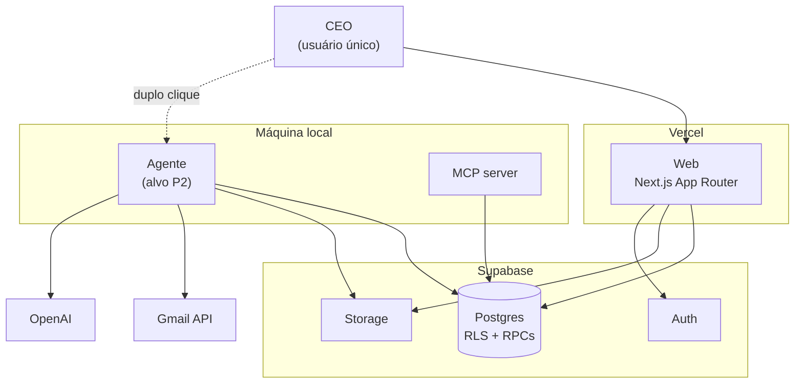

# Arquitetura-alvo híbrida

> Entregável §16.2 do plano mestre. Data: 2026-07-27.

## Contexto

Três execuções: aplicação web leve no Vercel, control plane no Supabase, agente local
instalável. Um pipeline canônico atendendo todos os canais. O desenho abaixo respeita
os limites do §5 e registra o que **já foi construído** em P0 versus o que continua
sendo alvo.

## C4 — Nível 1: contexto



## C4 — Nível 2: containers e responsabilidades

| Container    | Faz                                                                                                                 | **Não** faz                                                                          |
| ------------ | ------------------------------------------------------------------------------------------------------------------- | ------------------------------------------------------------------------------------ |
| Web (Vercel) | auth, captura, cadastros, revisão humana, agenda, dashboards, supervisão do agente                                  | OCR, rasterização, varredura histórica, parsing de centenas de páginas, loops longos |
| Supabase     | Auth, Postgres, Storage, RLS, Realtime, estado dos jobs, obrigações, evidências, drafts, materializações, auditoria | processamento pesado                                                                 |
| Agente local | Gmail, OCR, PDFs protegidos, parsing pesado, backfill, IA, fila local, retry, heartbeat                             | ser fonte de verdade                                                                 |
| MCP          | interface do **mesmo** domínio                                                                                      | ser um segundo sistema                                                               |

## Pipeline canônico

```
Câmera ──────┐
Upload web ──┤
Gmail ───────┼──► SourceAdapter ──► EvidenceEnvelope
Pasta local ─┤                            │
MCP ─────────┘                            ▼
                            extração + OCR + parsing
                                          ▼
                                   normalização
                                          ▼
                          fornecedor / produto / categoria
                                          ▼
                      ┌─── financial_obligation ◄── identity keys
                      │            ▼
                      │   conciliação e deduplicação
                      │            ▼
                      │      revisão humana
                      │            ▼
                      └──► materialização atômica  ◄── fn_materialize_draft_record
                                   ▼
                     agenda + caixa + cartões + dívidas
```

**Construído em P0:** identity keys, `financial_obligation`, deduplicação por
convergência de evidência, revisão humana com aprovação e lançamento distintos, e
materialização atômica.

**Alvo:** `SourceAdapter` com implementadores reais e `EvidenceEnvelope` construído —
os contratos existem em `packages/ingestion-types/`, sem nenhum implementador.

## Decisões arquiteturais tomadas

### ADR-002 — Contrato de draft em duas camadas

**Contexto:** gerador e materializador tinham schemas próprios e divergentes; 100% dos
drafts reprovavam.

**Decisão:** um pacote `@sbf/contracts` importado pelos dois lados, com **dois** schemas
por tipo: o honesto (o que o worker sabe) e o de lançamento (o que a tabela exige).

**Consequência:** um draft recém-gerado passa no primeiro e reprova no segundo. Isso não
é defeito — é a codificação explícita de "falta o humano escolher a conta", que antes
ficava escondida atrás de uma falha genérica.

### ADR-003 — Materialização por RPC, validação em TypeScript

**Contexto:** PostgREST não expõe transação multi-statement, então dois round-trips do
cliente deixavam transação órfã e permitiam duplo lançamento sob concorrência.

**Decisão:** híbrido. TS valida com Zod (fonte única compartilhada com o gerador) e monta
o payload; uma RPC faz travar → conferir → inserir → marcar → auditar numa transação.

**Rejeitado:** plpgsql puro duplicaria o contrato Zod de 4 tipos de draft, com
divergência garantida.

### ADR-004 — Obrigações ao lado de drafts, não no lugar

**Contexto:** `financial_obligations` existia sem nenhum código a tocando.

**Decisão:** `financial_obligations` responde "o que eu devo?"; `draft_records` responde
"o que escrever no ledger?". Uma obrigação tem N evidências e 1..N drafts.

**Consequência:** o mesmo boleto por Gmail e pasta local produz uma obrigação, duas
evidências e um draft — em vez de duas despesas.

### ADR-005 — Conjunto de chaves de identidade, não chave única

**Contexto:** nenhuma tupla única é computável a partir de boleto, lembrete, fatura e
comprovante ao mesmo tempo.

**Decisão:** cada documento emite todas as chaves que consegue calcular, com aridade e
versão idênticas; o casamento acontece por qualquer membro. `intent` nunca entra em
chave alguma.

### ADR-006 — Chave de criptografia em `private.crypto_keys`

**Rejeitado:** `ALTER DATABASE ... SET` (persiste em `pg_db_role_setting`, capturado por
`pg_dumpall`) e chave em env do worker (o repositório já vazou credenciais uma vez).

**Consequência:** nenhum cliente, worker, Edge Function ou variável de CI detém a chave.

### ADR-007 — Ambiente único de produção

**Contexto:** decisão do CEO de eliminar staging.

**Premissa registrada:** o produto tem **um único usuário**, que é o próprio CEO. Se
aparecer um segundo, esta decisão cai.

**Compensações obrigatórias:** `db reset` a cada PR, bloco `-- rollback:` em toda
migration, dump antes de push, portão humano no deploy.

## Alvo ainda não construído

### Fila durável com lease (`worker_jobs`)

`ingestion_jobs.status` é um **ciclo de vida de documento** com 14 estados, humanamente
bloqueante (`pending_review` fica dias). Uma fila precisa de estados de **execução**, com
lease, tentativas e backoff. Conflatar os dois é por que o poll precisa de `IN (5
status)`.

P1/P2 precisam de tipos de job **sem** `source_document_id` (`gmail.backfill`,
`recompute.projections`), que `ingestion_jobs` estruturalmente não hospeda — a tabela é
FK-ligada a `source_documents` e `run_id` é NOT NULL.

Claim por `FOR UPDATE SKIP LOCKED`, com reaproveitamento de lease expirado na própria
CTE — sem necessidade de `pg_cron`, que não está instalado.

> **Nota de P0:** lease não foi construído deliberadamente. `transitionJob` já faz
> `.eq("id", jobId).eq("status", from)` — locking otimista que torna a transição de um
> segundo worker um no-op. Suficiente para escritor único.

### Identidade de dispositivo

Par de chaves Ed25519 por máquina + Edge Function como broker de token, emitindo JWTs
curtos com `app_metadata.is_device`. RLS mantém `auth.uid() = user_id`, e as tabelas de
verdade financeira **negam escrita de dispositivo**:

```sql
create policy transactions_human_write on transactions for insert to authenticated
  with check (auth.uid() = user_id and not is_device_session());
```

Materializar é ato humano. Nenhuma `service_role` em máquina de usuário.

### Empacotamento do agente

`bun build --compile` (o monorepo já é Bun), instalador PowerShell e Scheduled Task —
não Electron (150 MB de Chromium para rodar job em background cuja supervisão já existe
na web), não bandeja nativa na v1.

Dependências nativas (`ocrmypdf`, `tesseract`, `qpdf`) são **capacidade**, não requisito:
o agente as detecta e reporta, e a fila nunca entrega trabalho de OCR a um agente que não
o faz.

### Upload direto ao Storage

`uploadDocument` tuneliza o arquivo por Server Action. **O limite padrão de body do
Vercel é 4,5 MB** — uma fatura escaneada de 10 MB falha hoje. Fluxo alvo: hash no cliente
→ `createUploadTicket` → `uploadToSignedUrl` → `confirmUpload`.

## Falhas e recuperação

| Falha                           | Comportamento                                                                                           |
| ------------------------------- | ------------------------------------------------------------------------------------------------------- |
| Insert de materialização falha  | Transação reverte inteira; draft segue `approved` e retentável; `materialization_error` explica na tela |
| Duas aprovações concorrentes    | `FOR UPDATE` serializa; uma retorna `posted`, a outra `already_posted`                                  |
| Convergência de obrigação falha | Registrada como WARN; ingestão continua — o documento ainda vale como draft                             |
| Senha não abre o PDF            | Tenta as candidatas em ordem de uso; ao esgotar, salva versão raw com `needs_manual_review`             |
| Documento duplicado             | Detectado por `content_hash`; evidência anexa à obrigação existente, sem novo lote                      |
