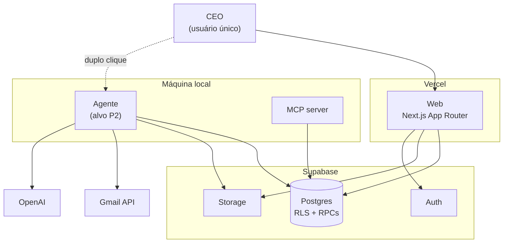
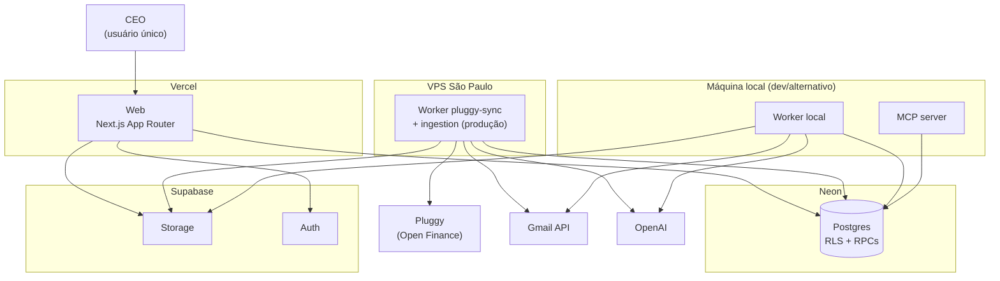

# Arquitetura-alvo híbrida

> Entregável §16.2 do plano mestre. Data: 2026-07-27.
> **Atualizado por ADR-008 (2026-08-24):** o backend de banco migra de Supabase Postgres
> para Neon; ver seção ADR-008 ao final. O pipeline canônico abaixo continua correto e
> não muda.

## Contexto

Três execuções: aplicação web leve no Vercel, control plane no Supabase, agente local
instalável. Um pipeline canônico atendendo todos os canais. O desenho abaixo respeita
os limites do §5 e registra o que **já foi construído** em P0 versus o que continua
sendo alvo.

## C4 — Nível 1: contexto

> Diagrama histórico (2026-07-27), pré-ADR-008. Para o desenho de infraestrutura atual
> (Neon + VPS), ver o diagrama na seção ADR-008.



## C4 — Nível 2: containers e responsabilidades

> Tabela histórica (2026-07-27), pré-ADR-008. "Supabase" nesta linha refere-se ao Postgres,
> que migra para Neon — ver ADR-008. Auth/Storage permanecem Supabase por ora.

| Container    | Faz                                                                                                                 | **Não** faz                                                                          |
| ------------ | ------------------------------------------------------------------------------------------------------------------- | ------------------------------------------------------------------------------------ |
| Web (Vercel) | auth, captura, cadastros, revisão humana, agenda, dashboards, supervisão do agente                                  | OCR, rasterização, varredura histórica, parsing de centenas de páginas, loops longos |
| Supabase     | Auth, Postgres, Storage, RLS, Realtime, estado dos jobs, obrigações, evidências, drafts, materializações, auditoria | processamento pesado                                                                 |
| Agente local | Gmail, OCR, PDFs protegidos, parsing pesado, backfill, IA, fila local, retry, heartbeat                             | ser fonte de verdade                                                                 |
| MCP          | interface do **mesmo** domínio                                                                                      | ser um segundo sistema                                                               |

## Pipeline canônico

```
Câmera ──────┐
Upload web ──┤
Gmail ───────┼──► SourceAdapter ──► EvidenceEnvelope
Pasta local ─┤                            │
MCP ─────────┘                            ▼
                            extração + OCR + parsing
                                          ▼
                                   normalização
                                          ▼
                          fornecedor / produto / categoria
                                          ▼
                      ┌─── financial_obligation ◄── identity keys
                      │            ▼
                      │   conciliação e deduplicação
                      │            ▼
                      │      revisão humana
                      │            ▼
                      └──► materialização atômica  ◄── fn_materialize_draft_record
                                   ▼
                     agenda + caixa + cartões + dívidas
```

**Construído em P0:** identity keys, `financial_obligation`, deduplicação por
convergência de evidência, revisão humana com aprovação e lançamento distintos, e
materialização atômica.

**Alvo:** `SourceAdapter` com implementadores reais e `EvidenceEnvelope` construído —
os contratos existem em `packages/ingestion-types/`, sem nenhum implementador.

## Decisões arquiteturais tomadas

### ADR-002 — Contrato de draft em duas camadas

**Contexto:** gerador e materializador tinham schemas próprios e divergentes; 100% dos
drafts reprovavam.

**Decisão:** um pacote `@sbf/contracts` importado pelos dois lados, com **dois** schemas
por tipo: o honesto (o que o worker sabe) e o de lançamento (o que a tabela exige).

**Consequência:** um draft recém-gerado passa no primeiro e reprova no segundo. Isso não
é defeito — é a codificação explícita de "falta o humano escolher a conta", que antes
ficava escondida atrás de uma falha genérica.

### ADR-003 — Materialização por RPC, validação em TypeScript

**Contexto:** PostgREST não expõe transação multi-statement, então dois round-trips do
cliente deixavam transação órfã e permitiam duplo lançamento sob concorrência.

**Decisão:** híbrido. TS valida com Zod (fonte única compartilhada com o gerador) e monta
o payload; uma RPC faz travar → conferir → inserir → marcar → auditar numa transação.

**Rejeitado:** plpgsql puro duplicaria o contrato Zod de 4 tipos de draft, com
divergência garantida.

### ADR-004 — Obrigações ao lado de drafts, não no lugar

**Contexto:** `financial_obligations` existia sem nenhum código a tocando.

**Decisão:** `financial_obligations` responde "o que eu devo?"; `draft_records` responde
"o que escrever no ledger?". Uma obrigação tem N evidências e 1..N drafts.

**Consequência:** o mesmo boleto por Gmail e pasta local produz uma obrigação, duas
evidências e um draft — em vez de duas despesas.

### ADR-005 — Conjunto de chaves de identidade, não chave única

**Contexto:** nenhuma tupla única é computável a partir de boleto, lembrete, fatura e
comprovante ao mesmo tempo.

**Decisão:** cada documento emite todas as chaves que consegue calcular, com aridade e
versão idênticas; o casamento acontece por qualquer membro. `intent` nunca entra em
chave alguma.

### ADR-006 — Chave de criptografia em `private.crypto_keys`

**Rejeitado:** `ALTER DATABASE ... SET` (persiste em `pg_db_role_setting`, capturado por
`pg_dumpall`) e chave em env do worker (o repositório já vazou credenciais uma vez).

**Consequência:** nenhum cliente, worker, Edge Function ou variável de CI detém a chave.

### ADR-007 — Ambiente único de produção

**Contexto:** decisão do CEO de eliminar staging.

**Premissa registrada:** o produto tem **um único usuário**, que é o próprio CEO. Se
aparecer um segundo, esta decisão cai.

**Compensações obrigatórias:** `db reset` a cada PR, bloco `-- rollback:` em toda
migration, dump antes de push, portão humano no deploy.

### ADR-008 — Migração de infraestrutura: Vercel + Neon + Worker VPS São Paulo

**Status:** Aprovada — 2026-08-24.

**Contexto:** decisão do CEO de mudar a arquitetura-alvo ("Estou mudando a arquitetura,
se vira"), no âmbito da integração Pluggy (Open Finance). Motivada pela necessidade de um
worker de longa duração e confiável (backfill de 365 dias, sync periódico de contas
bancárias) que não dependa de a máquina local do CEO estar ligada — requisito que o
"agente local instalável" (alvo P2 acima) não cobre para uma fonte de dados que precisa
rodar continuamente.

**Referências:** `docs/prompts/2026-08-24-prompt-integracao-pluggy.md`,
`docs/planejamento/2026-08-24-plano-integracao-pluggy.md`.

**Decisão:**

| Camada                  | Antes (ADR-007 / diagrama acima)           | Depois (ADR-008)                                                                                |
| ----------------------- | ------------------------------------------ | ----------------------------------------------------------------------------------------------- |
| Banco                   | Supabase Postgres                          | **Neon Postgres** (produção)                                                                    |
| Web/API                 | Vercel                                     | Vercel (mantém)                                                                                 |
| Worker de longa duração | Máquina local (agente instalável, alvo P2) | **VPS São Paulo** (`ssh root@ssh.chico-figueiredo.com.br`); local continua como alternativo/dev |
| Auth/Storage            | Supabase Auth + Storage                    | **Mantém Supabase Auth + Storage nesta fase** — ver gap abaixo                                  |

**Gap explícito, não fechado por esta ADR:** o app usa RLS do Supabase Auth e Storage
(buckets `ingestion-originals` etc.) em ~15 Server Actions e no scanner de Gmail. Migrar
Auth e Storage para fora do Supabase é um segundo projeto, fora de escopo aqui. Leitura
padrão adotada: migrar **apenas o Postgres** para Neon nesta fase — menor mudança que
satisfaz a decisão do CEO sem reescrever autenticação e upload. Reavaliar se o CEO pedir
saída completa do Supabase.

**Worker já isolado da Vercel:** verificado em 2026-08-24 — `workers/ingestion` já é um
pacote Bun standalone (`@sbf/worker-ingestion`, `package.json`/`tsconfig.json` próprios,
entrypoint `src/index.ts`), sem import algum a partir de `apps/web`. `bun run build` da
Vercel roda só `apps/web` (script `build` na raiz: `cd apps/web && bun run build`). Não
foi necessária mudança de código para este item — o isolamento já existia antes desta ADR.



**Consequências:**

- Positivas: worker roda 24/7 independente da máquina do CEO; Neon dá branching de banco
  (dev/preview isolados sem custo de um segundo projeto Supabase pago).
- Negativas / trade-offs: dois provedores de infra (Neon + Supabase) em vez de um só,
  até o gap de Auth/Storage ser resolvido; migração de dump/restore tem janela de corte
  a coordenar com o CEO (portão manual, ver ADR-007).
- Riscos mitigados: nenhum secret de produção (`DATABASE_URL`, `PLUGGY_CLIENT_SECRET`)
  entra no repo — checagem automatizada no CI antes de cada fechamento de fase (ver
  plano de integração Pluggy, seção 5).

### ADR-009 — Remoção completa do Supabase: Neon direto, sem Auth/Storage/PostgREST

**Status:** Aprovada — 2026-08-25.

**Contexto:** ADR-008 deixou um gap explícito, não fechado: "migrar Auth e Storage para
fora do Supabase é um segundo projeto... reavaliar se o CEO pedir saída completa do
Supabase." O CEO pediu, diretamente e sem meio-termo, nesta sessão — corrigindo uma
tentativa de deploy interino que ainda apontava pro Supabase Cloud existente
(`opwelsgdhksuuewdbefk`, distinto do projeto que a sessão de supervisão havia checado por
engano). Confirmado explicitamente: não é self-host de Auth/PostgREST/Storage na frente
do Neon (que manteria `@supabase/supabase-js` intacto) — é remoção total, SQL direto.

**Levantamento de impacto** (levantado antes de qualquer reescrita, não estimado de
cabeça):

- 17 Server Actions (3.496 linhas) em `apps/web/src/app/actions/`, todas usando
  `supabase.auth.getUser()` como portão de autorização.
- 48 arquivos no repo importam `@supabase/supabase-js` ou `@supabase/ssr` diretamente.
- 69 `CREATE POLICY` em 14 migrations, ~41 tabelas — majoritariamente o padrão simples
  `auth.uid() = user_id`; 3 tabelas de junção com `EXISTS`; 8 policies de bypass
  `service_role`; 8 em `storage.objects`.
- 12 pontos de chamada de Storage: 7 em `apps/web` (`import/page.tsx`,
  `upload-documents.tsx`, `ai-chat-drawer.tsx`, `actions/ingestion.ts`), 5 espalhados nos
  workers (`ingestion`, `gmail-scanner`, `local-scanner`).
- 4 workers ativos usando `supabase-js` só para CRUD via service-role (sem Auth, sem
  Storage exceto os já citados): `ingestion` (~37 chamadas `.from()`, 11 tabelas),
  `gmail-scanner` (~10, 4 tabelas), `local-scanner` (~5, 3 tabelas), `pluggy-sync` (~13, 6
  tabelas). `financial-evidence-worker` está vazio — zero impacto.
- `apps/mcp-server`: 12 arquivos, ~27 chamadas `.from()`, 7 tabelas, sem Auth/Storage.
- 4 Edge Functions (`merge-suppliers`, `refresh-mv-supplier-spending`,
  `retroactive-supplier-association`, `trigger-ingestion`) rodam no runtime Deno do
  Supabase, usando `supabase-js` de verdade (via esm.sh) — dependem de Auth (verificação
  de JWT do chamador) e de PostgREST, precisam de um novo lar.
- Auth em uso de verdade: Google OAuth, magic link, senha, refresh de sessão em
  `middleware.ts` (via `@supabase/ssr`). Confirmado com o CEO: só **Google OAuth** é
  usado no dia a dia — magic link e senha são superfície morta, não precisam de
  substituto equivalente.

**Decisão:**

| Camada                | Antes (ADR-008)                                   | Depois (ADR-009)                                                                                               |
| --------------------- | ------------------------------------------------- | -------------------------------------------------------------------------------------------------------------- |
| Banco                 | Neon Postgres, acesso via PostgREST/`supabase-js` | Neon Postgres, **SQL direto** (`@neondatabase/serverless` + Drizzle)                                           |
| Auth                  | Supabase Auth (OAuth+magic link+senha)            | Auth próprio mínimo — **só Google OAuth**, sessão via cookie assinado                                          |
| Storage               | Supabase Storage-API                              | **Vercel Blob direto** (`@vercel/blob` SDK) — obsoleta o design do shim S3-compatível cogitado antes desta ADR |
| Autorização por linha | RLS via PostgREST (69 policies)                   | **Filtragem explícita `WHERE user_id = $1`** na camada de aplicação — ver justificativa abaixo                 |
| Edge Functions        | Deno runtime do Supabase                          | Novo lar a decidir na execução (Vercel Functions/Cron) — não bloqueia esta ADR                                 |

**Por que abandonar RLS em vez de portar para o Neon (Neon suporta RLS nativamente):**
ADR-007 registra que este é um app de **usuário único** — o CEO. RLS existe pra impedir
que o usuário A veja dado do usuário B; essa classe de risco não existe aqui. Portar RLS
exigiria recriar o mecanismo que o PostgREST fazia de configurar `request.jwt.claims`/role
por requisição — complexidade real sem uma ameaça real que justifique. Filtragem explícita
por `user_id` na camada de aplicação é mais simples, mais direta de auditar, e reversível
(nada impede adicionar RLS no Neon depois, se um segundo usuário aparecer e ADR-007 cair).

**Fases e estimativa realista** (não "hoje" — o CEO foi informado do porte antes de
começar):

1. Provisionar Neon via integração nativa da Vercel Marketplace; camada de acesso a dados
   (Drizzle) com schema portado das migrations existentes.
2. Auth mínimo: Google OAuth + cookie de sessão assinado, substituindo `middleware.ts` e
   os 17 pontos de `getUser()`.
3. Storage: 12 pontos de chamada migrados pra `@vercel/blob`.
4. Reescrita das 17 Server Actions + arquivos dependentes usando a nova camada de dados e
   auth.
5. Workers (4 ativos) + MCP server: ~92 chamadas `.from()` portadas pra SQL/Drizzle.
6. Edge Functions: novo lar definido e portado.

Estimativa: **~1,5 semana** de trabalho focado, dado o corte de escopo de Auth (só Google
OAuth). Preservar os 3 métodos de auth teria levado a estimativa a 2-3 semanas.

**Consequências:**

- Positivas: um único provedor de infra (Neon + Vercel), sem Supabase em lugar nenhum;
  remove a dependência de PostgREST pra qualquer coisa; simplifica o modelo mental de
  autorização (uma linha de `WHERE`, não uma policy separada por tabela).
- Negativas / trade-offs: ~3.500 linhas de Server Actions + ~92 chamadas de worker
  reescritas é superfície grande pra revisar; Edge Functions perdem o runtime que as
  hospedava e precisam de destino novo; perde-se a defesa em profundidade de RLS (aceito
  dado ADR-007).
- Obsoleta: o design do `blob-s3-gateway` (shim S3-compatível pra Vercel Blob) cogitado
  antes desta ADR — não será implementado, o Storage-API que ele serviria deixa de
  existir.
- Riscos mitigados: nenhuma reescrita de Server Action começa antes desta ADR existir e
  ser revisada (regra da Verônica: spec antes de código, dado que a mudança toca
  autenticação e autorização de dados financeiros).

## Alvo ainda não construído

### Fila durável com lease (`worker_jobs`)

`ingestion_jobs.status` é um **ciclo de vida de documento** com 14 estados, humanamente
bloqueante (`pending_review` fica dias). Uma fila precisa de estados de **execução**, com
lease, tentativas e backoff. Conflatar os dois é por que o poll precisa de `IN (5
status)`.

P1/P2 precisam de tipos de job **sem** `source_document_id` (`gmail.backfill`,
`recompute.projections`), que `ingestion_jobs` estruturalmente não hospeda — a tabela é
FK-ligada a `source_documents` e `run_id` é NOT NULL.

Claim por `FOR UPDATE SKIP LOCKED`, com reaproveitamento de lease expirado na própria
CTE — sem necessidade de `pg_cron`, que não está instalado.

> **Nota de P0:** lease não foi construído deliberadamente. `transitionJob` já faz
> `.eq("id", jobId).eq("status", from)` — locking otimista que torna a transição de um
> segundo worker um no-op. Suficiente para escritor único.

### Identidade de dispositivo

Par de chaves Ed25519 por máquina + Edge Function como broker de token, emitindo JWTs
curtos com `app_metadata.is_device`. RLS mantém `auth.uid() = user_id`, e as tabelas de
verdade financeira **negam escrita de dispositivo**:

```sql
create policy transactions_human_write on transactions for insert to authenticated
  with check (auth.uid() = user_id and not is_device_session());
```

Materializar é ato humano. Nenhuma `service_role` em máquina de usuário.

### Empacotamento do agente

`bun build --compile` (o monorepo já é Bun), instalador PowerShell e Scheduled Task —
não Electron (150 MB de Chromium para rodar job em background cuja supervisão já existe
na web), não bandeja nativa na v1.

Dependências nativas (`ocrmypdf`, `tesseract`, `qpdf`) são **capacidade**, não requisito:
o agente as detecta e reporta, e a fila nunca entrega trabalho de OCR a um agente que não
o faz.

### Upload direto ao Storage

`uploadDocument` tuneliza o arquivo por Server Action. **O limite padrão de body do
Vercel é 4,5 MB** — uma fatura escaneada de 10 MB falha hoje. Fluxo alvo: hash no cliente
→ `createUploadTicket` → `uploadToSignedUrl` → `confirmUpload`.

## Falhas e recuperação

| Falha                           | Comportamento                                                                                           |
| ------------------------------- | ------------------------------------------------------------------------------------------------------- |
| Insert de materialização falha  | Transação reverte inteira; draft segue `approved` e retentável; `materialization_error` explica na tela |
| Duas aprovações concorrentes    | `FOR UPDATE` serializa; uma retorna `posted`, a outra `already_posted`                                  |
| Convergência de obrigação falha | Registrada como WARN; ingestão continua — o documento ainda vale como draft                             |
| Senha não abre o PDF            | Tenta as candidatas em ordem de uso; ao esgotar, salva versão raw com `needs_manual_review`             |
| Documento duplicado             | Detectado por `content_hash`; evidência anexa à obrigação existente, sem novo lote                      |
