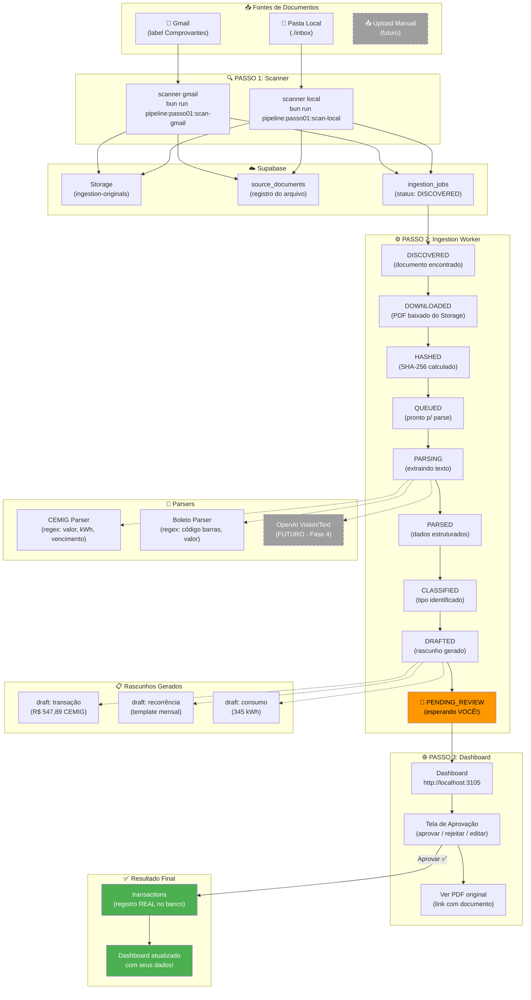
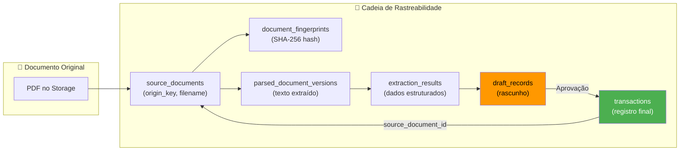

## Diagramas Visuais

### Pipeline Completa: Documento → Dashboard



### Vínculo: Documento ↔ Registro (Rastreabilidade Completa)



---

## Discussão

### Ana Silva (Arquiteta de Software):

CEO, entendo a confusão. Vou ser direta: **o sistema já está 80% funcional**. O que falta são os últimos passos de integração e validação. Deixa eu desenhar a situação:

**O que JÁ funciona:**

- Banco de dados completo (18 migrations, 30+ tabelas, RLS, seed com dados realistas)
- Scanner de Gmail (conecta, baixa anexos, faz upload, cria jobs)
- Scanner local (monitora pasta, mesma pipeline)
- Worker de ingestão (máquina de estados completa: DISCOVERED → POSTED)
- Parsers locais (CEMIG por regex, boleto genérico)
- Deduplicação por origin_key + content_hash
- Dashboard Next.js com resumo financeiro, transações, vencimentos, priorização
- Auth via Google OAuth
- MCP server com 8 ferramentas

**O que FALTA para você ver dados de verdade:**

1. Validar o scan do Gmail apontando para seu email real
2. Rodar o ingestion worker e verificar que os parsers funcionam com seus PDFs
3. Implementar a tela de aprovação de drafts no dashboard (E.1-E.15 do checklist)

Minha recomendação: **não faça tudo de uma vez**. O caminho mais rápido é:

1. `db:reset` para ter dados de seed
2. Subir o dashboard e ver que funciona
3. Depois plugar o Gmail scanner
4. Depois construir a UI de aprovação

### João Pereira (Backend Sênior / Bun):

Complementando a Ana, vou explicar **exatamente** o que cada worker faz, porque sei que o CEO tá confuso com a quantidade de peças:

**Scanner Gmail** (`workers/gmail-scanner/`):

- É um script CLI. Você roda, ele faz o trabalho e para.
- Conecta no Gmail via OAuth2 (token já gerado pelo `get:gmail-token`)
- Busca emails na label "Comprovantes" que tenham anexos
- Para cada anexo (PDF, imagem):
  - Gera um `origin_key` = `gmail-{messageId}-{attachmentId}` (identificador único)
  - Calcula SHA-256 do conteúdo
  - Verifica se já existe no banco (dedup)
  - Se novo: upload para Storage + cria `source_documents` + `ingestion_jobs`

**Ingestion Worker** (`workers/ingestion/`):

- É um **processo contínuo**. Fica rodando, fazendo poll a cada 5 segundos.
- Para cada job pendente, avança pela máquina de estados:
  - `DISCOVERED` → baixa o PDF do Storage
  - `DOWNLOADED` → calcula hash de verificação
  - `HASHED` → marca como pronto para parsing
  - `QUEUED` → extrai texto do PDF (pdf-parse)
  - `PARSING` → aplica parser adequado (CEMIG? boleto? genérico?)
  - `PARSED` → classifica tipo de draft (transação? recorrência? consumo?)
  - `CLASSIFIED` → reconciliação (futuro: compara com extrato)
  - `DRAFTED` → gera draft_records esperando aprovação
  - `PENDING_REVIEW` → **aqui para e espera VOCÊ aprovar**

Após aprovação:

- `APPROVED` → insere na tabela `transactions` real
- `POSTED` → fim, dado aparece no dashboard

**Sobre os scripts que criamos no package.json:**

```bash
bun run pipeline:passo00:db-reset     # Reseta banco com seed
bun run pipeline:passo00:db-start     # Sobe Supabase local
bun run pipeline:passo01:scan-gmail   # Escaneia Gmail (50 emails)
bun run pipeline:passo01:scan-local   # Monitora pasta ./inbox
bun run pipeline:passo02:ingest       # Processa documentos
bun run pipeline:passo03:dev          # Sobe dashboard
```

A ordem numérica é intencional. Passo 0 → 1 → 2 → 3. Três terminais.

### Maria Oliveira (Backend Sênior / Bun):

Sobre a questão **"como a IA vai ler o documento"** — hoje não é IA, são **parsers locais com regex**. E isso é uma decisão consciente:

**Fase atual (regex local):**

1. `pdf-parse` extrai texto bruto do PDF
2. Se o PDF tem senha, o worker busca no Supabase Vault (`user_secrets`)
3. O texto vai para o `parse-orchestrator.ts` que detecta qual parser usar:
   - Texto contém "CEMIG"? → `cemig-parser.ts` (extrai valor, kWh, vencimento, competência)
   - Texto contém código de barras? → `boleto-parser.ts` (extrai valor, vencimento, beneficiário)
   - Nenhum match? → salva texto bruto e marca como `PARSED` com baixa confiança

**O que muda com IA (Fase 4, futuro):**

- `ParserType.OPENAI_VISION`: envia imagem do PDF para GPT-4 Vision
- `ParserType.OPENAI_TEXT`: envia texto extraído para GPT-4 Text
- IA classifica automaticamente: categoria, tags, prioridade, fornecedor
- IA sugere se é recorrente (baseado em padrão mensal)
- IA aprende com suas correções (feedback loop)

**O importante:** a estrutura de dados já está preparada para IA. O campo `parser_type` no `parsed_document_versions` já tem os enums `OPENAI_VISION` e `OPENAI_TEXT`. Quando plugarmos a API, é só adicionar um novo parser — a máquina de estados e o fluxo de aprovação não mudam.

**Sobre a confiança (confidence_score):**

- Cada extração tem um score de 0 a 1
- Regex CEMIG com todos os campos: ~0.95
- Boleto genérico com dados parciais: ~0.60
- IA futura provavelmente: ~0.85-0.95
- Na UI de aprovação, mostre o score para o usuário decidir se confia ou revisa

### Roberto Lima (Frontend Sênior / React):

Sobre o dashboard atual e o que falta:

**O que JÁ existe no dashboard (`apps/web/src/app/dashboard/`):**

- `page.tsx`: cards resumo (receita, despesa, saldo, dívida total)
- Priorização com `prioritizeItems()` do domínio
- Lista de transações recentes
- Próximos vencimentos (30 dias)
- Faturas de cartão em aberto
- Dívidas ativas
- Recorrências pendentes

**O que FALTA (e é o gap que causa a confusão do CEO):**

- **Tela de aprovação de drafts** — a peça que conecta o worker ao dashboard
- Rotas para: listar batches, ver drafts pendentes, aprovar/rejeitar, ver documento original
- Sem essa tela, os dados ficam no banco como `PENDING_REVIEW` mas o CEO não vê

Minha proposta imediata: criar uma **página simples** em `/dashboard/ingestion` que:

1. Lista os `draft_batches` com status `OPEN` ou `REVIEWING`
2. Para cada batch, mostra os `draft_records` com dados extraídos
3. Botões: Aprovar, Rejeitar, Editar
4. Link para o documento original no Storage
5. Badge com confidence_score

Isso é a peça que falta para fechar o ciclo. Não precisa ser bonito agora, precisa funcionar.

### Sofia Almeida (Frontend Sênior / React):

Concordo com o Roberto. E sobre a questão **"os registros serão vinculados ao documento"**:

**Já está modelado no banco!** O campo `source_document_id` existe em:

- `ingestion_jobs` → qual job processou aquele documento
- `parsed_document_versions` → versões de texto extraído
- `extraction_results` → dados estruturados
- `draft_records` → rascunhos gerados
- `transactions` → transação final (após aprovação)

Então o fluxo de revisão funciona assim:

1. Usuário vê uma transação no dashboard
2. Clica em "Ver documento original"
3. Sistema busca `source_document_id` → `storage_path`
4. Abre o PDF do Supabase Storage em nova aba
5. Usuário compara os dados extraídos com o documento real

Para a UI de aprovação de drafts, proponho:

- Layout split-view: PDF à esquerda, dados extraídos à direita
- Campos editáveis (valor, data, fornecedor, categoria)
- Tags sugeridas em chips clicáveis
- Prioridade em dropdown
- Botão "Aprovar e criar transação"

### Fernando Gomes (DevOps Sênior):

Sobre a experiência de desenvolvimento local:

**Pré-requisitos que o CEO precisa ter:**

1. **Docker** rodando (Supabase local usa containers)
2. **Bun** instalado (`curl -fsSL https://bun.sh/install | bash`)
3. **Supabase CLI** (`brew install supabase/tap/supabase` ou `npm i -g supabase`)
4. **Token Gmail** gerado (já fizemos via `get:gmail-token`)
5. **`.env.local`** configurado (já existe no projeto)

**Os scripts que criamos são auto-explicativos:**

```
pipeline:passo00  → banco (infraestrutura)
pipeline:passo01  → scanners (descoberta de documentos)
pipeline:passo02  → ingestion (processamento)
pipeline:passo03  → dashboard (visualização)
```

Cada número é uma camada. Você sobe de baixo para cima. Precisa de 3 terminais simultâneos (ou usa tmux/screen).

**Sugestão: criar um script `pipeline:up` que sobe tudo de uma vez com processos em background?**

Não recomendo por enquanto. É melhor ver o output de cada processo separadamente para entender o que está acontecendo. Depois que estiver confortável, automatizamos.

### Ricardo Monteiro (Economista):

Do ponto de vista financeiro, quero reforçar que a **arquitetura de drafts com aprovação humana é correta e essencial:**

1. **Erros de extração acontecem.** Regex pode ler valor errado, confundir datas. O link direto com o documento permite revisão.
2. **Duplicatas precisam ser tratadas.** O mesmo boleto pode chegar por email e por banco. A dedup por hash + origin_key resolve isso.
3. **Classificação automática não é perfeita.** Mesmo com IA, o usuário precisa validar se é despesa, transferência interna, ou pagamento de fatura.
4. **O confidence_score é fundamental.** Drafts com 95% de confiança podem ser auto-aprovados no futuro. Drafts com 60% obrigam revisão.

Sobre a prioridade imediata do CEO: o seed.sql já tem dados realistas suficientes para ver o dashboard funcionando. O fluxo Gmail → Ingestion → Dashboard é o objetivo de curto prazo, mas **não bloqueie o uso do sistema pela falta dele**. O dashboard com dados manuais/seed já é útil.

### Camila Duarte (Finanças Pessoais):

Pensando como consultora de finanças pessoais e no perfil do CEO (programador com dívidas, múltiplos cartões, aversão a burocracia):

**O maior risco aqui é o CEO desistir de usar o sistema por achar complicado demais.**

Minha recomendação executiva:

1. **Hoje (5 minutos):** `db:reset` + `dev` → dashboard com dados de seed. Explore o sistema. Sinta como é.
2. **Amanhã (30 minutos):** Adicione 2-3 transações manualmente. Veja como categorias, tags e prioridade funcionam.
3. **Essa semana (2 horas):** Teste o pipeline Gmail com 10 emails. Veja os drafts serem gerados. Aprove pelo MCP.
4. **Próxima semana:** Use o dashboard diariamente. Anote o que incomoda. Isso vai direcionar a UI de aprovação.

**Não tente fazer tudo de uma vez.** O sistema já funciona para controle manual. A automação via pipeline é um bônus incremental.

### André Santos (DBA PostgreSQL):

Sobre a base de dados:

O seed.sql já cria um cenário completo:

- **3 bancos** com produtos distintos
- **6 fornecedores** reais (CEMIG, COPASA, Claro, iFood, Uber, Spotify)
- **7 categorias** (moradia, alimentação, transporte, etc.)
- **4 tags** com influência de prioridade
- **Transações de teste** em múltiplos meses
- **Períodos financeiros** personalizados
- **Templates recorrentes** mensais

Ao rodar `bun run pipeline:passo00:db-reset`, tudo isso é criado automaticamente. O dashboard vai ter dados para mostrar.

**Performance:** Os índices já estão otimizados para as queries do dashboard. O mv_supplier_spending (materialized view) agrega gastos por fornecedor por mês. Quando tiver mais dados, basta chamar o Edge Function `refresh-mv-supplier-spending` para atualizar.

### Helena Vargas (UX/UI):

Sobre a tela de aprovação de drafts que o Roberto mencionou:

Proponho uma hierarquia de informação clara:

1. **Badge no sidebar**: "3 pendentes" com cor de atenção
2. **Página `/dashboard/ingestion`**: lista de batches com resumo
3. **Detalhe do batch**: cards de drafts com:
   - Tipo (transação, recorrência, consumo)
   - Dados extraídos (valor, data, fornecedor)
   - Score de confiança (verde >80%, amarelo 50-80%, vermelho <50%)
   - Preview do documento (thumbnail ou link)
   - Ações: Aprovar / Editar / Rejeitar
4. **Aprovação em massa**: "Aprovar todos com confiança > 90%"

A acessibilidade dessa tela é crítica: o CEO vai usar muito. Precisa ser rápida, com atalhos de teclado.

### Renata Silva (QA Visual/A11y):

Sobre os estados e testes visuais que precisamos cobrir:

**Estados da tela de ingestão:**

- Vazio: nenhum draft pendente → mensagem amigável
- Carregando: skeleton/spinner
- Com dados: lista de drafts
- Erro: falha ao carregar → retry
- Aprovação parcial: alguns aprovados, alguns rejeitados
- Tudo aprovado: sucesso com feedback

**Testes necessários:**

- Contraste dos badges de confiança
- Navegação por teclado nos botões de aprovação
- Screen reader anuncia tipo + valor + ação
- Estados de foco visíveis nos cards

---

## Prós e Contras

### Opção A: Focar primeiro no Dashboard com Seed Data (recomendação da equipe)

**Prós:**

- Funciona em 5 minutos (`db:reset` + `dev`)
- Zero dependências externas (não precisa de Gmail, Docker já cobre)
- CEO entende o sistema antes de complexificar com pipeline
- Baixo risco de frustração
- Permite feedback imediato sobre UX

**Contras:**

- Dados não são "seus" (são do seed)
- Não testa a pipeline real
- Pode dar falsa sensação de que tudo funciona

### Opção B: Ir direto para Pipeline Gmail → Dashboard

**Prós:**

- Usa dados reais do CEO
- Testa pipeline completa end-to-end
- Mais motivador ver suas contas reais

**Contras:**

- Depende de Gmail OAuth + label configurada
- Se qualquer peça falhar, é frustração imediata
- Tela de aprovação de drafts não existe ainda (precisa do MCP ou SQL direto)
- Maior curva de aprendizado de uma vez

### Opção C: Abordagem incremental (A → B)

**Prós:**

- Começa fácil (seed), evolui para real (Gmail)
- Cada passo valida o anterior
- Documenta problemas gradualmente
- Equipe tem tempo de construir UI de aprovação enquanto CEO usa dados de seed

**Contras:**

- Mais lento para ter dados 100% reais
- Requer disciplina de seguir os passos

---

## Decisão Final

A equipe **unanimemente recomenda a Opção C (incremental)**, com o seguinte plano de ação:

### Semana 1 (Imediato — esta semana)

| #   | Ação                                                     | Responsável | Status |
| --- | -------------------------------------------------------- | ----------- | ------ |
| 1   | CEO roda `db:reset` + `dev` e explora dashboard com seed | CEO         | 🔲     |
| 2   | CEO adiciona 3-5 transações manuais no dashboard         | CEO         | 🔲     |
| 3   | CEO testa scan Gmail com `--dry-run` (10 emails)         | CEO + João  | 🔲     |
| 4   | CEO roda scan Gmail real + ingestion worker              | CEO + João  | 🔲     |
| 5   | CEO aprova drafts via MCP ou Supabase Studio             | CEO + Maria | 🔲     |

### Semana 2 (Próxima semana)

| #   | Ação                                                    | Responsável     | Status |
| --- | ------------------------------------------------------- | --------------- | ------ |
| 6   | Criar página `/dashboard/ingestion` (lista de batches)  | Roberto + Sofia | 🔲     |
| 7   | Criar detalhe de draft com preview do documento         | Roberto + Sofia | 🔲     |
| 8   | Criar botões aprovar/rejeitar/editar com server actions | Roberto         | 🔲     |
| 9   | Adicionar badge "pendentes" no sidebar                  | Sofia           | 🔲     |
| 10  | Testes de acessibilidade da tela de ingestão            | Renata + Helena | 🔲     |

### Semana 3+ (Evolução)

| #   | Ação                                                 | Responsável    | Status |
| --- | ---------------------------------------------------- | -------------- | ------ |
| 11  | Split-view: PDF + dados extraídos lado a lado        | Sofia + Helena | 🔲     |
| 12  | Auto-aprovação para confidence > 0.90 (configurável) | Maria          | 🔲     |
| 13  | Novos parsers (COPASA, Claro, genérico melhorado)    | João + Maria   | 🔲     |
| 14  | CI/CD Vercel integrado com GitLab                    | Fernando       | 🔲     |
| 15  | Planejamento da integração OpenAI (Fase 4)           | Ana + equipe   | 🔲     |

---

## Ações / Responsáveis / Prazo

- **Ação 1**: CEO explora dashboard com dados de seed — CEO — 2026-03-27
- **Ação 2**: CEO testa pipeline Gmail com dry-run — CEO + João — 2026-03-28
- **Ação 3**: CEO roda pipeline real e aprova via MCP — CEO + Maria — 2026-03-29
- **Ação 4**: Roberto + Sofia iniciam tela de aprovação `/dashboard/ingestion` — Roberto, Sofia — 2026-03-31
- **Ação 5**: Renata valida acessibilidade dos novos componentes — Renata — 2026-04-04
- **Ação 6**: Fernando finaliza CI/CD Vercel + GitLab — Fernando — 2026-04-07

---

## Mensagem Final ao CEO

CEO, em resumo:

**Você NÃO precisa entender tudo de uma vez.** O sistema é composto de peças independentes que se conectam. A confusão é normal — são muitas partes móveis.

**A sequência é simples:**

1. 📦 `bun run pipeline:passo00:db-reset` → banco com dados prontos
2. 🌐 `bun run pipeline:passo03:dev` → dashboard funcionando
3. 📧 `bun run pipeline:passo01:scan-gmail` → documetos do Gmail
4. ⚙️ `bun run pipeline:passo02:ingest` → processa e gera rascunhos
5. ✅ Você aprova → dados reais no dashboard

**Cada `pipeline:passoNN` é um passo numerado.** Siga a ordem. Sem pular.

O passo-a-passo completo está em `docs/passo-a-passo/005-como-ter-dados-no-dashboard-local.md`.
